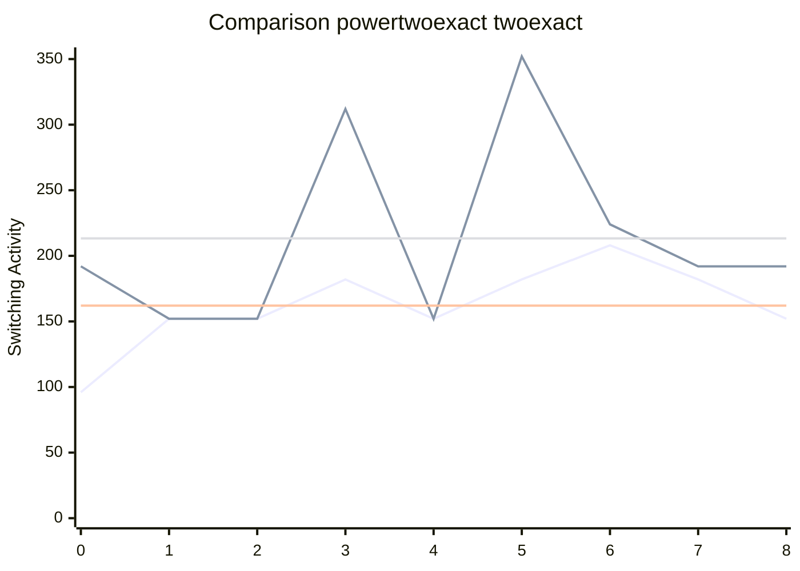

[INFO] Running Benchmark for k=4

test

test

test

Synthesising 0x0008 pexact:152 r=3 exact:192 r=3

```mermaid
xychart-beta
    title "Comparison powertwoexact twoexact"
    x-axis [0, 1, 2, 3, 4, 5, 6, 7, 8]
    y-axis "Switching Activity" 0-->352
    line [96, 152, 152, 182, 152, 182, 208, 182, 152]
    line [192, 152, 152, 312, 152, 352, 224, 192, 192]
    line [162.0, 162.0, 162.0, 162.0, 162.0, 162.0, 162.0, 162.0, 162.0]
    line [213.33333333333334, 213.33333333333334, 213.33333333333334, 213.33333333333334, 213.33333333333334, 213.33333333333334, 213.33333333333334, 213.33333333333334, 213.33333333333334]
```
