Synthesising 0x0000 pexact:96 r=4 exact:192 r=4

Synthesising 0x0001 pexact:152 r=3 exact:152 r=3

Synthesising 0x0002 pexact:152 r=3 exact:152 r=3

Synthesising 0x0003 pexact:182 r=4 exact:312 r=4

Synthesising 0x0004 pexact:152 r=3 exact:152 r=3

Synthesising 0x0005 pexact:182 r=4 exact:352 r=4

Synthesising 0x0006 pexact:208 r=4 exact:224 r=3

Synthesising 0x0007 pexact:182 r=4 exact:192 r=3

Synthesising 0x0008 pexact:152 r=3 exact:192 r=3

Synthesising 0x0009 pexact:208 r=4 exact:224 r=3

Synthesising 0x000A pexact:182 r=4 exact:352 r=4

Synthesising 0x000B pexact:182 r=4 exact:216 r=3

Synthesising 0x000C pexact:182 r=4 exact:320 r=4

Synthesising 0x000D pexact:182 r=4 exact:216 r=3

Synthesising 0x000E pexact:182 r=4 exact:216 r=3

Synthesising 0x000F pexact:182 r=4 exact:352 r=4

Synthesising 0x0010 pexact:152 r=3 exact:152 r=3

Synthesising 0x0011 pexact:182 r=4 exact:326 r=4

Synthesising 0x0012 pexact:208 r=4 exact:224 r=3

Synthesising 0x0013 pexact:182 r=4 exact:216 r=3

Synthesising 0x0014 pexact:208 r=4 exact:224 r=3

Synthesising 0x0015 pexact:182 r=4 exact:192 r=3

Synthesising 0x0016 pexact:406 r=6 exact:464 r=5

Synthesising 0x0017 pexact:400 r=6 exact:448 r=5

Synthesising 0x0018 pexact:336 r=5 exact:352 r=4

Synthesising 0x0019 pexact:310 r=5 exact:344 r=4

Synthesising 0x001A pexact:310 r=5 exact:344 r=4

Synthesising 0x001B pexact:304 r=5 exact:320 r=4

Synthesising 0x001C pexact:310 r=5 exact:336 r=4

Synthesising 0x001D pexact:304 r=5 exact:352 r=4

Synthesising 0x001E pexact:224 r=3 exact:224 r=3

Synthesising 0x001F pexact:216 r=3 exact:216 r=3

Synthesising 0x0020 pexact:152 r=3 exact:192 r=3

Synthesising 0x0021 pexact:208 r=4 exact:224 r=3

Synthesising 0x0022 pexact:182 r=4 exact:318 r=4

Synthesising 0x0023 pexact:182 r=4 exact:192 r=3

Synthesising 0x0024 pexact:336 r=5 exact:352 r=4

Synthesising 0x0025 pexact:310 r=5 exact:344 r=4

Synthesising 0x0026 pexact:310 r=5 exact:344 r=4

Synthesising 0x0027 pexact:304 r=5 exact:312 r=4

Synthesising 0x0028 pexact:208 r=4 exact:224 r=3

Synthesising 0x0029 pexact:406 r=6 exact:448 r=5

Synthesising 0x002A pexact:182 r=4 exact:192 r=3

Synthesising 0x002B pexact:400 r=6 exact:440 r=5

Synthesising 0x002C pexact:310 r=5 exact:344 r=4

Synthesising 0x002D pexact:224 r=3 exact:224 r=3

Synthesising 0x002E pexact:304 r=5 exact:312 r=4

Synthesising 0x002F pexact:216 r=3 exact:216 r=3

Synthesising 0x0030 pexact:182 r=4 exact:320 r=4

Synthesising 0x0031 pexact:182 r=4 exact:216 r=3

Synthesising 0x0032 pexact:182 r=4 exact:216 r=3

Synthesising 0x0033 pexact:182 r=4 exact:280 r=4

Synthesising 0x0034 pexact:310 r=5 exact:344 r=4

Synthesising 0x0035 pexact:304 r=5 exact:312 r=4

Synthesising 0x0036 pexact:224 r=3 exact:224 r=3

Synthesising 0x0037 pexact:216 r=3 exact:216 r=3

Synthesising 0x0038 pexact:310 r=5 exact:344 r=4

Synthesising 0x0039 pexact:224 r=3 exact:224 r=3

Synthesising 0x003A pexact:304 r=5 exact:320 r=4

Synthesising 0x003B pexact:216 r=3 exact:216 r=3

Synthesising 0x003C pexact:280 r=4 exact:344 r=4

Synthesising 0x003D pexact:326 r=5 exact:336 r=4

Synthesising 0x003E pexact:326 r=5 exact:344 r=4

Synthesising 0x003F pexact:238 r=5 exact:288 r=4

Synthesising 0x0040 pexact:152 r=3 exact:152 r=3

Synthesising 0x0041 pexact:208 r=4 exact:224 r=3

Synthesising 0x0042 pexact:336 r=5 exact:352 r=4

Synthesising 0x0043 pexact:310 r=5 exact:336 r=4

Synthesising 0x0044 pexact:182 r=4 exact:320 r=4

Synthesising 0x0045 pexact:182 r=4 exact:192 r=3

Synthesising 0x0046 pexact:310 r=5 exact:344 r=4

```mermaid
xychart-beta
    title "Comparison powertwoexact twoexact"
    x-axis [0, 1, 2, 3, 4, 5, 6, 7, 8, 9, 10, 11, 12, 13, 14, 15, 16, 17, 18, 19, 20, 21, 22, 23, 24, 25, 26, 27, 28, 29, 30, 31, 32, 33, 34, 35, 36, 37, 38, 39, 40, 41, 42, 43, 44, 45, 46, 47, 48, 49, 50, 51, 52, 53, 54, 55, 56, 57, 58, 59, 60, 61, 62, 63, 64, 65, 66, 67, 68, 69, 70]
    y-axis "Switching Activity" 0-->464
    line [96, 152, 152, 182, 152, 182, 208, 182, 152, 208, 182, 182, 182, 182, 182, 182, 152, 182, 208, 182, 208, 182, 406, 400, 336, 310, 310, 304, 310, 304, 224, 216, 152, 208, 182, 182, 336, 310, 310, 304, 208, 406, 182, 400, 310, 224, 304, 216, 182, 182, 182, 182, 310, 304, 224, 216, 310, 224, 304, 216, 280, 326, 326, 238, 152, 208, 336, 310, 182, 182, 310]
    line [192, 152, 152, 312, 152, 352, 224, 192, 192, 224, 352, 216, 320, 216, 216, 352, 152, 326, 224, 216, 224, 192, 464, 448, 352, 344, 344, 320, 336, 352, 224, 216, 192, 224, 318, 192, 352, 344, 344, 312, 224, 448, 192, 440, 344, 224, 312, 216, 320, 216, 216, 280, 344, 312, 224, 216, 344, 224, 320, 216, 344, 336, 344, 288, 152, 224, 352, 336, 320, 192, 344]
    line [238.19718309859155, 238.19718309859155, 238.19718309859155, 238.19718309859155, 238.19718309859155, 238.19718309859155, 238.19718309859155, 238.19718309859155, 238.19718309859155, 238.19718309859155, 238.19718309859155, 238.19718309859155, 238.19718309859155, 238.19718309859155, 238.19718309859155, 238.19718309859155, 238.19718309859155, 238.19718309859155, 238.19718309859155, 238.19718309859155, 238.19718309859155, 238.19718309859155, 238.19718309859155, 238.19718309859155, 238.19718309859155, 238.19718309859155, 238.19718309859155, 238.19718309859155, 238.19718309859155, 238.19718309859155, 238.19718309859155, 238.19718309859155, 238.19718309859155, 238.19718309859155, 238.19718309859155, 238.19718309859155, 238.19718309859155, 238.19718309859155, 238.19718309859155, 238.19718309859155, 238.19718309859155, 238.19718309859155, 238.19718309859155, 238.19718309859155, 238.19718309859155, 238.19718309859155, 238.19718309859155, 238.19718309859155, 238.19718309859155, 238.19718309859155, 238.19718309859155, 238.19718309859155, 238.19718309859155, 238.19718309859155, 238.19718309859155, 238.19718309859155, 238.19718309859155, 238.19718309859155, 238.19718309859155, 238.19718309859155, 238.19718309859155, 238.19718309859155, 238.19718309859155, 238.19718309859155, 238.19718309859155, 238.19718309859155, 238.19718309859155, 238.19718309859155, 238.19718309859155, 238.19718309859155, 238.19718309859155]
    line [277.3521126760563, 277.3521126760563, 277.3521126760563, 277.3521126760563, 277.3521126760563, 277.3521126760563, 277.3521126760563, 277.3521126760563, 277.3521126760563, 277.3521126760563, 277.3521126760563, 277.3521126760563, 277.3521126760563, 277.3521126760563, 277.3521126760563, 277.3521126760563, 277.3521126760563, 277.3521126760563, 277.3521126760563, 277.3521126760563, 277.3521126760563, 277.3521126760563, 277.3521126760563, 277.3521126760563, 277.3521126760563, 277.3521126760563, 277.3521126760563, 277.3521126760563, 277.3521126760563, 277.3521126760563, 277.3521126760563, 277.3521126760563, 277.3521126760563, 277.3521126760563, 277.3521126760563, 277.3521126760563, 277.3521126760563, 277.3521126760563, 277.3521126760563, 277.3521126760563, 277.3521126760563, 277.3521126760563, 277.3521126760563, 277.3521126760563, 277.3521126760563, 277.3521126760563, 277.3521126760563, 277.3521126760563, 277.3521126760563, 277.3521126760563, 277.3521126760563, 277.3521126760563, 277.3521126760563, 277.3521126760563, 277.3521126760563, 277.3521126760563, 277.3521126760563, 277.3521126760563, 277.3521126760563, 277.3521126760563, 277.3521126760563, 277.3521126760563, 277.3521126760563, 277.3521126760563, 277.3521126760563, 277.3521126760563, 277.3521126760563, 277.3521126760563, 277.3521126760563, 277.3521126760563, 277.3521126760563]
    bar [80, 60, 60, 80, 60, 80, 80, 80, 60, 80, 80, 80, 80, 80, 80, 80, 60, 80, 80, 80, 80, 80, 120, 120, 100, 100, 100, 100, 100, 100, 60, 60, 60, 80, 80, 80, 100, 100, 100, 100, 80, 120, 80, 120, 100, 60, 100, 60, 80, 80, 80, 80, 100, 100, 60, 60, 100, 60, 100, 60, 80, 100, 100, 100, 60, 80, 100, 100, 80, 80, 100]
    bar [80, 60, 60, 80, 60, 80, 60, 60, 60, 60, 80, 60, 80, 60, 60, 80, 60, 80, 60, 60, 60, 60, 100, 100, 80, 80, 80, 80, 80, 80, 60, 60, 60, 60, 80, 60, 80, 80, 80, 80, 60, 100, 60, 100, 80, 60, 80, 60, 80, 60, 60, 80, 80, 80, 60, 60, 80, 60, 80, 60, 80, 80, 80, 80, 60, 60, 80, 80, 80, 60, 80]
```

