[INFO] Running Benchmark for k=4

[INFO] Number of NPN Classes:222

[INFO] Synthesising NPN Class=0 TruthTable:0x0000 pexact:96 r=4 exact:192 r=4 time=0.03min 

[INFO] Synthesising NPN Class=1 TruthTable:0x0001 pexact:152 r=3 exact:152 r=3 time=0.08min 

[INFO] Synthesising NPN Class=2 TruthTable:0x0003 pexact:182 r=4 exact:312 r=4 time=0.16min 

[INFO] Synthesising NPN Class=3 TruthTable:0x0006 pexact:208 r=4 exact:224 r=3 time=0.29min 

[INFO] Synthesising NPN Class=4 TruthTable:0x0007 pexact:182 r=4 exact:192 r=3 time=0.37min 

[INFO] Synthesising NPN Class=5 TruthTable:0x000F pexact:182 r=4 exact:352 r=4 time=0.47min 

[INFO] Synthesising NPN Class=6 TruthTable:0x0016 pexact:406 r=6 exact:464 r=5 time=64.09min 

```mermaid
xychart-beta
    title "Comparison powertwoexact twoexact"
    x-axis [0, 1, 3, 6, 7, 15, 22]
    y-axis "Switching Activity" 0-->464
    line [96, 152, 182, 208, 182, 182, 406]
    line [192, 152, 312, 224, 192, 352, 464]
    line [201.14285714285714, 201.14285714285714, 201.14285714285714, 201.14285714285714, 201.14285714285714, 201.14285714285714, 201.14285714285714]
    line [269.7142857142857, 269.7142857142857, 269.7142857142857, 269.7142857142857, 269.7142857142857, 269.7142857142857, 269.7142857142857]
    bar [80, 60, 80, 80, 80, 80, 120]
    bar [80, 60, 80, 60, 60, 80, 100]
```

