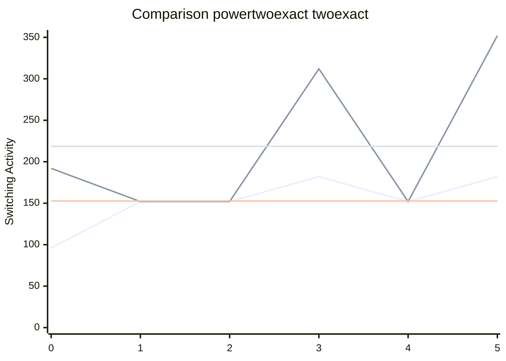

[INFO] Running Benchmark for k=4

test

test

test
Synthesising 0x0000 pexact:96 r=4 exact:192 r=4

Synthesising 0x0001 pexact:152 r=3 exact:152 r=3

Synthesising 0x0002 pexact:152 r=3 exact:152 r=3

Synthesising 0x0003 pexact:182 r=4 exact:312 r=4

Synthesising 0x0004 pexact:152 r=3 exact:152 r=3

Synthesising 0x0005 pexact:182 r=4 exact:352 r=4

