Synthesising 0x0000 pexact:96 r=4 exact:192 r=4

Synthesising 0x0001 pexact:152 r=3 exact:152 r=3

Synthesising 0x0002 pexact:152 r=3 exact:152 r=3

Synthesising 0x0003 pexact:182 r=4 exact:312 r=4

Synthesising 0x0004 pexact:152 r=3 exact:152 r=3

Synthesising 0x0005 pexact:182 r=4 exact:352 r=4

Synthesising 0x0006 pexact:208 r=4 exact:224 r=3

Synthesising 0x0007 pexact:182 r=4 exact:192 r=3

Synthesising 0x0008 pexact:152 r=3 exact:192 r=3

Synthesising 0x0009 pexact:208 r=4 exact:224 r=3

```mermaid
xychart-beta
    title "Comparison powertwoexact twoexact"
    x-axis [0, 1, 2, 3, 4, 5, 6, 7, 8, 9]
    y-axis "Switching Activity" 0-->352
    line [96, 152, 152, 182, 152, 182, 208, 182, 152, 208]
    line [192, 152, 152, 312, 152, 352, 224, 192, 192, 224]
    line [166.6, 166.6, 166.6, 166.6, 166.6, 166.6, 166.6, 166.6, 166.6, 166.6]
    line [214.4, 214.4, 214.4, 214.4, 214.4, 214.4, 214.4, 214.4, 214.4, 214.4]
    bar [80, 60, 60, 80, 60, 80, 80, 80, 60, 80]
    bar [80, 60, 60, 80, 60, 80, 60, 60, 60, 60]
```

