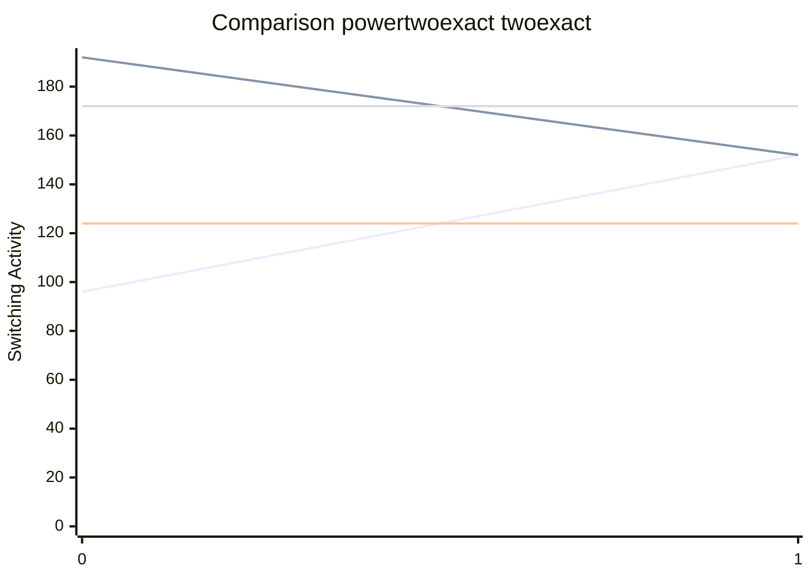

[INFO] Running Benchmark for k=4

test

test

test

Synthesising 0x0001 pexact:152 r=3 exact:152 r=3

```mermaid
xychart-beta
    title "Comparison powertwoexact twoexact"
    x-axis [0, 1]
    y-axis "Switching Activity" 0-->192
    line [96, 152]
    line [192, 152]
    line [124.0, 124.0]
    line [172.0, 172.0]
```
