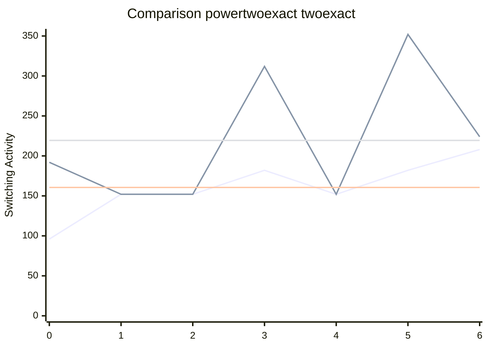

[INFO] Running Benchmark for k=4

test

test

test

Synthesising 0x0006 pexact:208 r=4 exact:224 r=3

```mermaid
xychart-beta
    title "Comparison powertwoexact twoexact"
    x-axis [0, 1, 2, 3, 4, 5, 6]
    y-axis "Switching Activity" 0-->352
    line [96, 152, 152, 182, 152, 182, 208]
    line [192, 152, 152, 312, 152, 352, 224]
    line [160.57142857142858, 160.57142857142858, 160.57142857142858, 160.57142857142858, 160.57142857142858, 160.57142857142858, 160.57142857142858]
    line [219.42857142857142, 219.42857142857142, 219.42857142857142, 219.42857142857142, 219.42857142857142, 219.42857142857142, 219.42857142857142]
```
