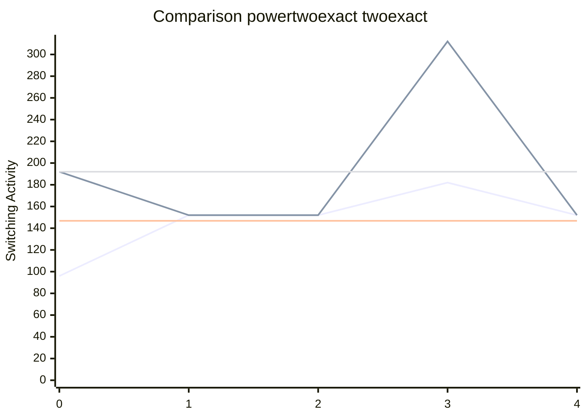

[INFO] Running Benchmark for k=4

test

test

test

Synthesising 0x0004 pexact:152 r=3 exact:152 r=3

```mermaid
xychart-beta
    title "Comparison powertwoexact twoexact"
    x-axis [0, 1, 2, 3, 4]
    y-axis "Switching Activity" 0-->312
    line [96, 152, 152, 182, 152]
    line [192, 152, 152, 312, 152]
    line [146.8, 146.8, 146.8, 146.8, 146.8]
    line [192.0, 192.0, 192.0, 192.0, 192.0]
```
