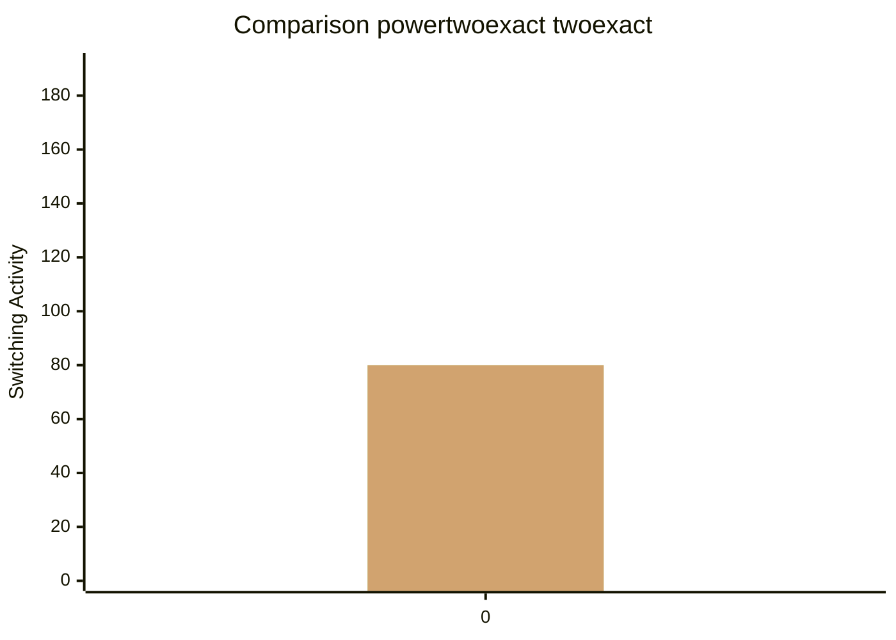

[INFO] Running Benchmark for k=4

[INFO] Number of NPN Classes:222

[INFO] Synthesising NPN Class=0 TruthTable:0x0000 pexact:96 r=4 exact:192 r=4 time=0.03min 

```mermaid
xychart-beta
    title "Comparison powertwoexact twoexact"
    x-axis [0]
    y-axis "Switching Activity" 0-->192
    line [96]
    line [192]
    line [96.0]
    line [192.0]
    bar [80]
    bar [80]
```

