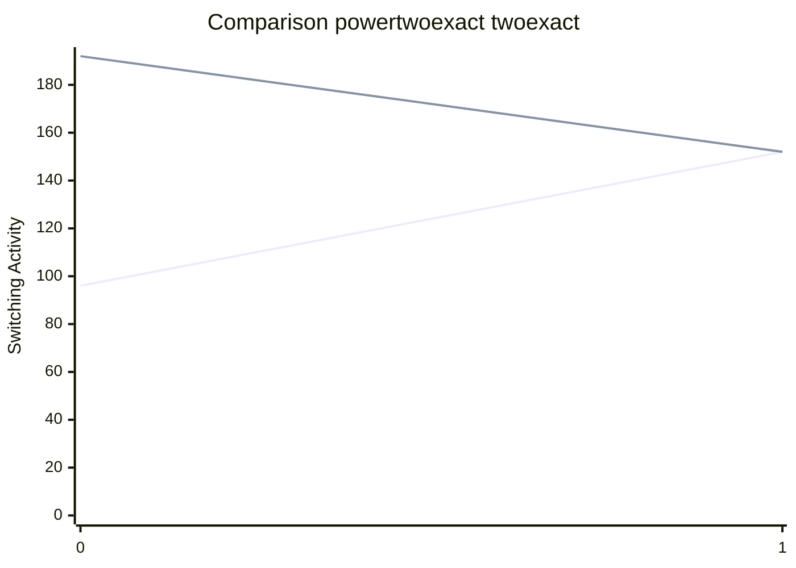

[INFO] Running Benchmark for k=4

test

test

test

test

Synthesising 0x0000 pexact:96 r=4 exact:192 r=4

Synthesising 0x0001 pexact:152 r=3 exact:152 r=3

 avg_p_s=124.0 avg_s=172.0 avg_pr=3.5 avg_r=3.5

