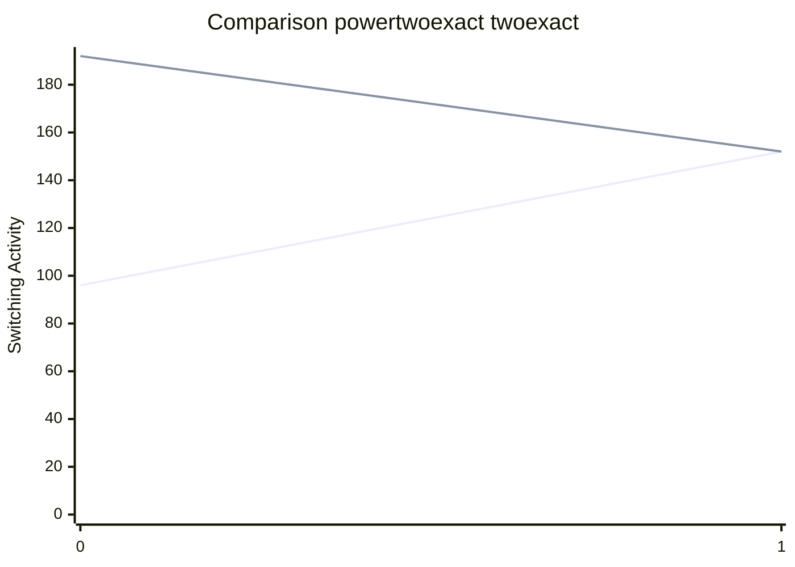
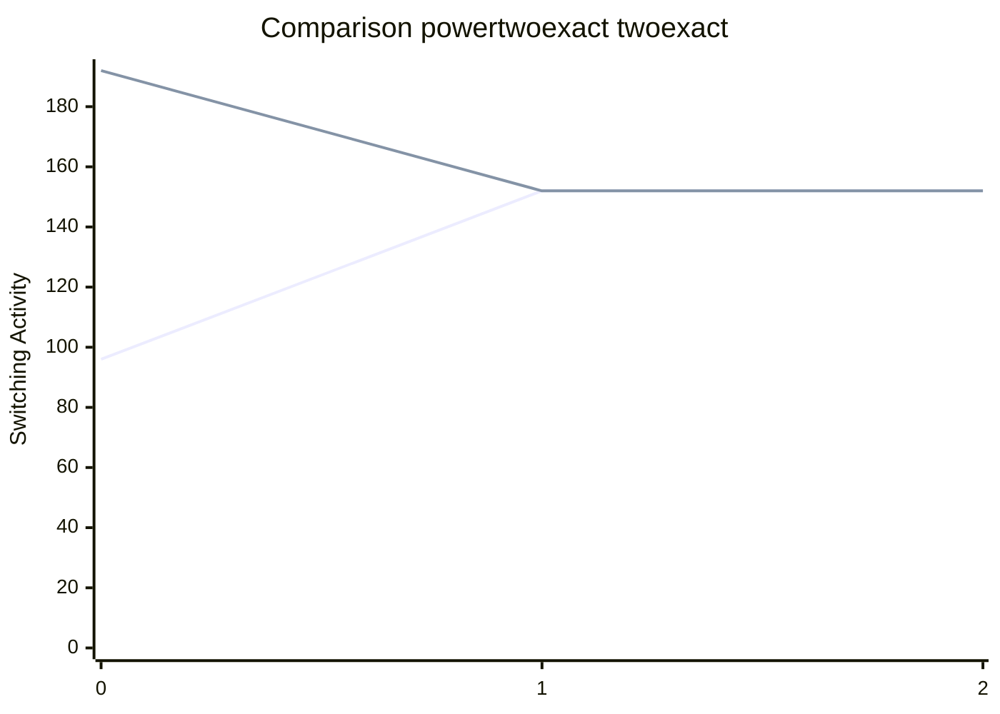
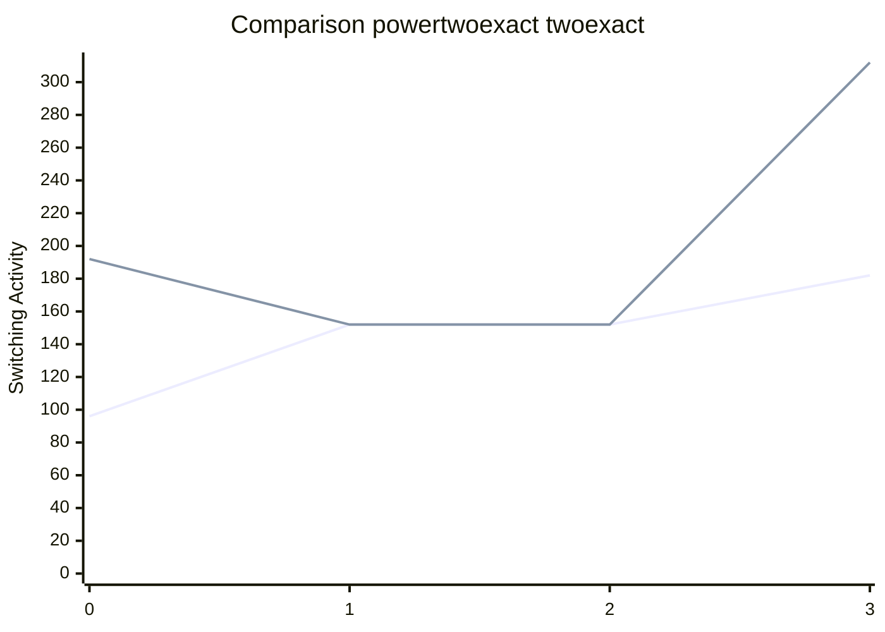
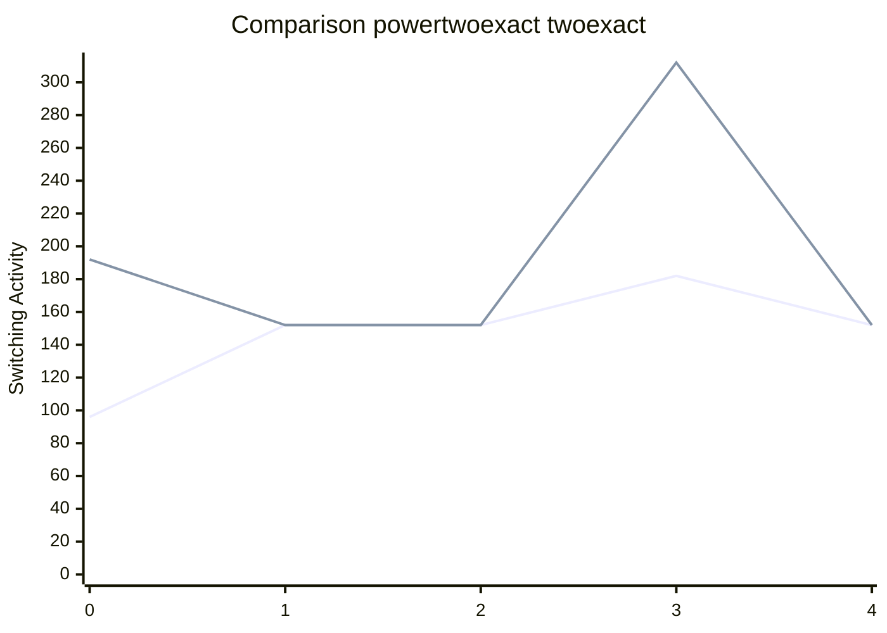
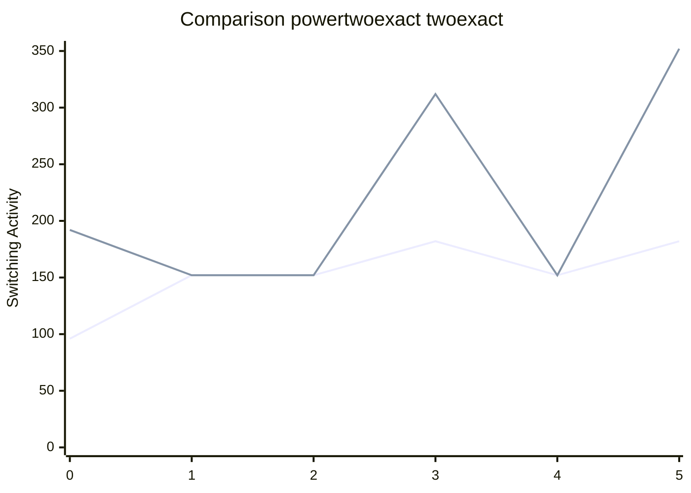

[INFO] Running Benchmark for k=4

test

test

test

Synthesising 0x0000 pexact:96 r=4 exact:192 r=4

```mermaid
xychart-beta
    title "Comparison powertwoexact twoexact"
    x-axis [0]
    y-axis "Switching Activity" 0-->192
    line [96]
    line [192]
```
 avg_p_s=96.0 avg_s=192.0 avg_pr=4.0 avg_r=4.0

Synthesising 0x0001 pexact:152 r=3 exact:152 r=3


 avg_p_s=124.0 avg_s=172.0 avg_pr=3.5 avg_r=3.5

Synthesising 0x0002 pexact:152 r=3 exact:152 r=3


 avg_p_s=133.33 avg_s=165.33 avg_pr=3.33 avg_r=3.33

Synthesising 0x0003 pexact:182 r=4 exact:312 r=4


 avg_p_s=145.5 avg_s=202.0 avg_pr=3.5 avg_r=3.5

Synthesising 0x0004 pexact:152 r=3 exact:152 r=3


 avg_p_s=146.8 avg_s=192.0 avg_pr=3.4 avg_r=3.4

Synthesising 0x0005 pexact:182 r=4 exact:352 r=4


 avg_p_s=152.67 avg_s=218.67 avg_pr=3.5 avg_r=3.5

