[INFO] Running Benchmark for k=4

[INFO] Number of NPN Classes:222

[INFO] Synthesising NPN Class=0 TruthTable:0x0000 pexact:182 r=4 exact:192 r=4 time=0.0min 

[INFO] Synthesising NPN Class=1 TruthTable:0x0001 pexact:152 r=3 exact:152 r=3 time=0.02min 

[INFO] Synthesising NPN Class=2 TruthTable:0x0003 pexact:182 r=4 exact:312 r=4 time=0.04min 

[INFO] Synthesising NPN Class=3 TruthTable:0x0006 pexact:208 r=4 exact:224 r=3 time=0.06min 

[INFO] Synthesising NPN Class=4 TruthTable:0x0007 pexact:182 r=4 exact:192 r=3 time=0.08min 

[INFO] Synthesising NPN Class=5 TruthTable:0x000F pexact:182 r=4 exact:352 r=4 time=0.1min 

[INFO] Synthesising NPN Class=6 TruthTable:0x0016 pexact:406 r=6 exact:464 r=5 time=5.51min 

[INFO] Synthesising NPN Class=7 TruthTable:0x0017 pexact:400 r=6 exact:448 r=5 time=10.47min 

[INFO] Synthesising NPN Class=8 TruthTable:0x0018 pexact:336 r=5 exact:352 r=4 time=11.1min 

[INFO] Synthesising NPN Class=9 TruthTable:0x0019 pexact:310 r=5 exact:344 r=4 time=11.32min 

[INFO] Synthesising NPN Class=10 TruthTable:0x001B pexact:304 r=5 exact:320 r=4 time=11.59min 

[INFO] Synthesising NPN Class=11 TruthTable:0x001E pexact:224 r=3 exact:224 r=3 time=11.63min 

[INFO] Synthesising NPN Class=12 TruthTable:0x001F pexact:216 r=3 exact:216 r=3 time=11.66min 

[INFO] Synthesising NPN Class=13 TruthTable:0x003C pexact:280 r=4 exact:344 r=4 time=11.74min 

[INFO] Synthesising NPN Class=14 TruthTable:0x003D pexact:326 r=5 exact:336 r=4 time=11.99min 

[INFO] Synthesising NPN Class=15 TruthTable:0x003F pexact:238 r=5 exact:288 r=4 time=12.01min 

[INFO] Synthesising NPN Class=16 TruthTable:0x0069 pexact:256 r=3 exact:256 r=3 time=12.06min 

[INFO] Synthesising NPN Class=17 TruthTable:0x006B pexact:432 r=5 exact:464 r=5 time=18.66min 

[INFO] Synthesising NPN Class=18 TruthTable:0x006F pexact:224 r=3 exact:224 r=3 time=18.68min 

[INFO] Synthesising NPN Class=19 TruthTable:0x007E pexact:352 r=4 exact:352 r=4 time=19.29min 

[INFO] Synthesising NPN Class=20 TruthTable:0x01FF pexact:152 r=3 exact:152 r=3 time=19.31min 

[INFO] Synthesising NPN Class=21 TruthTable:0x00FF pexact:182 r=4 exact:182 r=4 time=19.33min 

[INFO] Synthesising NPN Class=22 TruthTable:0x0116 pexact:516 r=9 exact:704 r=7 time=469.0min 

[INFO] Synthesising NPN Class=23 TruthTable:0x0117 pexact:520 r=9 exact:574 r=7 time=866.71min 

[INFO] Synthesising NPN Class=24 TruthTable:0x0118 pexact:446 r=8 exact:600 r=6 time=881.05min 

[INFO] Synthesising NPN Class=25 TruthTable:0x0119 pexact:420 r=8 exact:552 r=6 time=887.66min 

[INFO] Synthesising NPN Class=26 TruthTable:0x011A pexact:416 r=7 exact:560 r=6 time=893.19min 

[INFO] Synthesising NPN Class=27 TruthTable:0x011B pexact:412 r=7 exact:464 r=6 time=898.05min 

[INFO] Synthesising NPN Class=28 TruthTable:0x011E pexact:356 r=6 exact:472 r=5 time=898.65min 

[INFO] Synthesising NPN Class=29 TruthTable:0x011F pexact:356 r=6 exact:390 r=5 time=899.26min 

[INFO] Synthesising NPN Class=30 TruthTable:0x012C pexact:448 r=5 exact:480 r=5 time=911.88min 

```mermaid
xychart-beta
    title "Comparison powertwoexact twoexact"
    x-axis [0, 1, 3, 6, 7, 15, 22, 23, 24, 25, 27, 30, 31, 60, 61, 63, 105, 107, 111, 126, 511, 255, 278, 279, 280, 281, 282, 283, 286, 287, 300]
    y-axis "Switching Activity" 0-->704
    line [182, 152, 182, 208, 182, 182, 406, 400, 336, 310, 304, 224, 216, 280, 326, 238, 256, 432, 224, 352, 152, 182, 516, 520, 446, 420, 416, 412, 356, 356, 448]
    line [192, 152, 312, 224, 192, 352, 464, 448, 352, 344, 320, 224, 216, 344, 336, 288, 256, 464, 224, 352, 152, 182, 704, 574, 600, 552, 560, 464, 472, 390, 480]
    line [310.19354838709677, 310.19354838709677, 310.19354838709677, 310.19354838709677, 310.19354838709677, 310.19354838709677, 310.19354838709677, 310.19354838709677, 310.19354838709677, 310.19354838709677, 310.19354838709677, 310.19354838709677, 310.19354838709677, 310.19354838709677, 310.19354838709677, 310.19354838709677, 310.19354838709677, 310.19354838709677, 310.19354838709677, 310.19354838709677, 310.19354838709677, 310.19354838709677, 310.19354838709677, 310.19354838709677, 310.19354838709677, 310.19354838709677, 310.19354838709677, 310.19354838709677, 310.19354838709677, 310.19354838709677, 310.19354838709677]
    line [360.83870967741933, 360.83870967741933, 360.83870967741933, 360.83870967741933, 360.83870967741933, 360.83870967741933, 360.83870967741933, 360.83870967741933, 360.83870967741933, 360.83870967741933, 360.83870967741933, 360.83870967741933, 360.83870967741933, 360.83870967741933, 360.83870967741933, 360.83870967741933, 360.83870967741933, 360.83870967741933, 360.83870967741933, 360.83870967741933, 360.83870967741933, 360.83870967741933, 360.83870967741933, 360.83870967741933, 360.83870967741933, 360.83870967741933, 360.83870967741933, 360.83870967741933, 360.83870967741933, 360.83870967741933, 360.83870967741933]
    bar [80, 60, 80, 80, 80, 80, 120, 120, 100, 100, 100, 60, 60, 80, 100, 100, 60, 100, 60, 80, 60, 80, 180, 180, 160, 160, 140, 140, 120, 120, 100]
    bar [80, 60, 80, 60, 60, 80, 100, 100, 80, 80, 80, 60, 60, 80, 80, 80, 60, 100, 60, 80, 60, 80, 140, 140, 120, 120, 120, 120, 100, 100, 100]
```

