[INFO] Running Benchmark for k=4

[INFO] Number of NPN Classes:222

test

test

test

test

test

test

[INFO] Synthesising NPN Class=0 TruthTable:0x0000 pexact:182 r=4 exact:192 r=4 time=0.0min 

```mermaid
xychart-beta
    title "Comparison powertwoexact twoexact"
    x-axis [0]
    y-axis "Switching Activity" 0-->192
    line [182]
    line [192]
    line [182.0]
    line [192.0]
    bar [80]
    bar [80]
```

[INFO] Synthesising NPN Class=1 TruthTable:0x0001 pexact:152 r=3 exact:152 r=3 time=0.02min 

```mermaid
xychart-beta
    title "Comparison powertwoexact twoexact"
    x-axis [0, 1]
    y-axis "Switching Activity" 0-->192
    line [182, 152]
    line [192, 152]
    line [167.0, 167.0]
    line [172.0, 172.0]
    bar [80, 60]
    bar [80, 60]
```

[INFO] Synthesising NPN Class=2 TruthTable:0x0003 pexact:182 r=4 exact:312 r=4 time=0.04min 

```mermaid
xychart-beta
    title "Comparison powertwoexact twoexact"
    x-axis [0, 1, 3]
    y-axis "Switching Activity" 0-->312
    line [182, 152, 182]
    line [192, 152, 312]
    line [172.0, 172.0, 172.0]
    line [218.66666666666666, 218.66666666666666, 218.66666666666666]
    bar [80, 60, 80]
    bar [80, 60, 80]
```

[INFO] Synthesising NPN Class=3 TruthTable:0x0006 pexact:208 r=4 exact:224 r=3 time=0.06min 

```mermaid
xychart-beta
    title "Comparison powertwoexact twoexact"
    x-axis [0, 1, 3, 6]
    y-axis "Switching Activity" 0-->312
    line [182, 152, 182, 208]
    line [192, 152, 312, 224]
    line [181.0, 181.0, 181.0, 181.0]
    line [220.0, 220.0, 220.0, 220.0]
    bar [80, 60, 80, 80]
    bar [80, 60, 80, 60]
```

