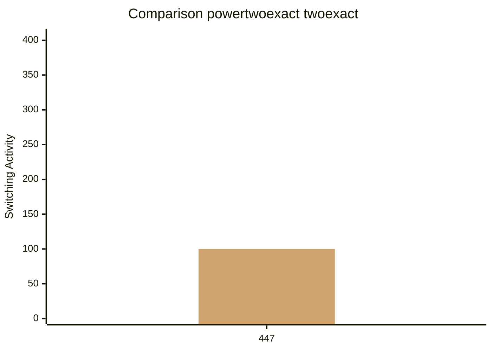

[INFO] Synthesising NPN Class=0 TruthTable:0x01BF pexact:408 r=5 exact:400 r=5 time=1.03min 

```mermaid
xychart-beta
    title "Comparison powertwoexact twoexact"
    x-axis [447]
    y-axis "Switching Activity" 0-->408
    line [408]
    line [400]
    line [408.0]
    line [400.0]
    bar [100]
    bar [100]
```

