[INFO] Synthesising NPN Class=0 TruthTable:0x01BF pexact:408 r=5 exact:400 r=5 time=1.03min 

[INFO] Synthesising NPN Class=1 TruthTable:0x01E8 pexact:856 r=8 exact:560 r=6 time=379.41min 

[INFO] Synthesising NPN Class=2 TruthTable:0x01E9 pexact:824 r=8 exact:552 r=6 time=641.79min 

[INFO] Synthesising NPN Class=3 TruthTable:0x01EA pexact:448 r=5 exact:448 r=5 time=643.45min 

[INFO] Synthesising NPN Class=4 TruthTable:0x01EB pexact:440 r=5 exact:438 r=5 time=644.46min 

[INFO] Synthesising NPN Class=5 TruthTable:0x03FD pexact:294 r=4 exact:270 r=4 time=644.5min 

[INFO] Synthesising NPN Class=6 TruthTable:0x01EF pexact:280 r=4 exact:272 r=4 time=644.55min 

[INFO] Synthesising NPN Class=7 TruthTable:0x01FE pexact:152 r=3 exact:152 r=3 time=644.57min 

[INFO] Synthesising NPN Class=8 TruthTable:0x033C pexact:454 r=7 exact:576 r=6 time=659.97min 

[INFO] Synthesising NPN Class=9 TruthTable:0x033D pexact:468 r=6 exact:542 r=6 time=690.86min 

[INFO] Synthesising NPN Class=10 TruthTable:0x033F pexact:454 r=7 exact:512 r=6 time=705.27min 

[INFO] Synthesising NPN Class=11 TruthTable:0x0356 pexact:192 r=3 exact:192 r=3 time=705.29min 

[INFO] Synthesising NPN Class=12 TruthTable:0x0357 pexact:192 r=3 exact:192 r=3 time=705.31min 

[INFO] Synthesising NPN Class=13 TruthTable:0x0358 pexact:446 r=5 exact:454 r=5 time=706.59min 

[INFO] Synthesising NPN Class=14 TruthTable:0x0359 pexact:320 r=4 exact:320 r=4 time=706.74min 

[INFO] Synthesising NPN Class=15 TruthTable:0x035C pexact:312 r=4 exact:312 r=4 time=706.85min 

[INFO] Synthesising NPN Class=16 TruthTable:0x035D pexact:320 r=4 exact:320 r=4 time=706.97min 

[INFO] Synthesising NPN Class=17 TruthTable:0x035E pexact:448 r=5 exact:448 r=5 time=708.91min 

[INFO] Synthesising NPN Class=18 TruthTable:0x035F pexact:312 r=4 exact:312 r=4 time=709.02min 

```mermaid
xychart-beta
    title "Comparison powertwoexact twoexact"
    x-axis [447, 488, 489, 490, 491, 1021, 495, 510, 828, 829, 831, 854, 855, 856, 857, 860, 861, 862, 863]
    y-axis "Switching Activity" 0-->856
    line [408, 856, 824, 448, 440, 294, 280, 152, 454, 468, 454, 192, 192, 446, 320, 312, 320, 448, 312]
    line [400, 560, 552, 448, 438, 270, 272, 152, 576, 542, 512, 192, 192, 454, 320, 312, 320, 448, 312]
    line [401.05263157894734, 401.05263157894734, 401.05263157894734, 401.05263157894734, 401.05263157894734, 401.05263157894734, 401.05263157894734, 401.05263157894734, 401.05263157894734, 401.05263157894734, 401.05263157894734, 401.05263157894734, 401.05263157894734, 401.05263157894734, 401.05263157894734, 401.05263157894734, 401.05263157894734, 401.05263157894734, 401.05263157894734]
    line [382.7368421052632, 382.7368421052632, 382.7368421052632, 382.7368421052632, 382.7368421052632, 382.7368421052632, 382.7368421052632, 382.7368421052632, 382.7368421052632, 382.7368421052632, 382.7368421052632, 382.7368421052632, 382.7368421052632, 382.7368421052632, 382.7368421052632, 382.7368421052632, 382.7368421052632, 382.7368421052632, 382.7368421052632]
    bar [100, 160, 160, 100, 100, 80, 80, 60, 140, 120, 140, 60, 60, 100, 80, 80, 80, 100, 80]
    bar [100, 120, 120, 100, 100, 80, 80, 60, 120, 120, 120, 60, 60, 100, 80, 80, 80, 100, 80]
```

