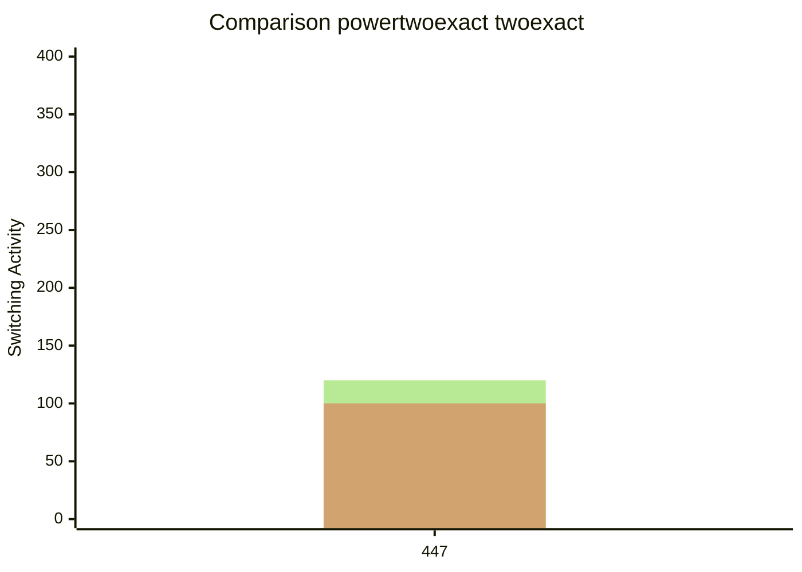

[INFO] Synthesising NPN Class=0 TruthTable:0x01BF pexact:392 r=6 exact:400 r=5 time=2.04min 

```mermaid
xychart-beta
    title "Comparison powertwoexact twoexact"
    x-axis [447]
    y-axis "Switching Activity" 0-->400
    line [392]
    line [400]
    line [392.0]
    line [400.0]
    bar [120]
    bar [100]
```

