[INFO] Synthesising NPN Class=0 TruthTable:0x01BF pexact:408 r=5 exact:400 r=5 time=1.03min 

[INFO] Synthesising NPN Class=1 TruthTable:0x01E8 pexact:856 r=8 exact:560 r=6 time=379.41min 

[INFO] Synthesising NPN Class=2 TruthTable:0x01E9 pexact:824 r=8 exact:552 r=6 time=641.79min 

[INFO] Synthesising NPN Class=3 TruthTable:0x01EA pexact:448 r=5 exact:448 r=5 time=643.45min 

```mermaid
xychart-beta
    title "Comparison powertwoexact twoexact"
    x-axis [447, 488, 489, 490]
    y-axis "Switching Activity" 0-->856
    line [408, 856, 824, 448]
    line [400, 560, 552, 448]
    line [634.0, 634.0, 634.0, 634.0]
    line [490.0, 490.0, 490.0, 490.0]
    bar [100, 160, 160, 100]
    bar [100, 120, 120, 100]
```

