[INFO] Synthesising NPN Class=0 TruthTable:0x0000 pexact:182 r=4 exact:192 r=4 time=0.07min 

[INFO] Synthesising NPN Class=1 TruthTable:0x0001 pexact:152 r=3 exact:152 r=3 time=0.21min 

[INFO] Synthesising NPN Class=2 TruthTable:0x0003 pexact:182 r=4 exact:312 r=4 time=0.3min 

[INFO] Synthesising NPN Class=3 TruthTable:0x0006 pexact:208 r=4 exact:224 r=3 time=0.51min 

[INFO] Synthesising NPN Class=4 TruthTable:0x0007 pexact:182 r=4 exact:192 r=3 time=0.67min 

[INFO] Synthesising NPN Class=5 TruthTable:0x000F pexact:182 r=4 exact:352 r=4 time=0.76min 

[INFO] Synthesising NPN Class=6 TruthTable:0x0016 pexact:406 r=6 exact:464 r=5 time=3.91min 

[INFO] Synthesising NPN Class=7 TruthTable:0x0017 pexact:400 r=6 exact:448 r=5 time=5.04min 

[INFO] Synthesising NPN Class=8 TruthTable:0x0018 pexact:336 r=5 exact:352 r=4 time=5.51min 

[INFO] Synthesising NPN Class=9 TruthTable:0x0019 pexact:310 r=5 exact:344 r=4 time=5.95min 

```mermaid
xychart-beta
    title "Comparison powertwoexact twoexact"
    x-axis [0, 1, 3, 6, 7, 15, 22, 23, 24, 25]
    y-axis "Switching Activity" 0-->464
    line [182, 152, 182, 208, 182, 182, 406, 400, 336, 310]
    line [192, 152, 312, 224, 192, 352, 464, 448, 352, 344]
    line [254.0, 254.0, 254.0, 254.0, 254.0, 254.0, 254.0, 254.0, 254.0, 254.0]
    line [303.2, 303.2, 303.2, 303.2, 303.2, 303.2, 303.2, 303.2, 303.2, 303.2]
    bar [80, 60, 80, 80, 80, 80, 120, 120, 100, 100]
    bar [80, 60, 80, 60, 60, 80, 100, 100, 80, 80]
```

