[INFO] Synthesising NPN Class=0 TruthTable:0x0000 pexact:182 r=4 exact:192 r=4 time=0.07min 

[INFO] Synthesising NPN Class=1 TruthTable:0x0001 pexact:152 r=3 exact:152 r=3 time=0.21min 

[INFO] Synthesising NPN Class=2 TruthTable:0x0003 pexact:182 r=4 exact:312 r=4 time=0.3min 

[INFO] Synthesising NPN Class=3 TruthTable:0x0006 pexact:208 r=4 exact:224 r=3 time=0.51min 

[INFO] Synthesising NPN Class=4 TruthTable:0x0007 pexact:182 r=4 exact:192 r=3 time=0.67min 

[INFO] Synthesising NPN Class=5 TruthTable:0x000F pexact:182 r=4 exact:352 r=4 time=0.76min 

[INFO] Synthesising NPN Class=6 TruthTable:0x0016 pexact:406 r=6 exact:464 r=5 time=3.91min 

[INFO] Synthesising NPN Class=7 TruthTable:0x0017 pexact:400 r=6 exact:448 r=5 time=5.04min 

[INFO] Synthesising NPN Class=8 TruthTable:0x0018 pexact:336 r=5 exact:352 r=4 time=5.51min 

[INFO] Synthesising NPN Class=9 TruthTable:0x0019 pexact:310 r=5 exact:344 r=4 time=5.95min 

[INFO] Synthesising NPN Class=10 TruthTable:0x001B pexact:304 r=5 exact:320 r=4 time=6.38min 

[INFO] Synthesising NPN Class=11 TruthTable:0x001E pexact:224 r=3 exact:224 r=3 time=6.54min 

[INFO] Synthesising NPN Class=12 TruthTable:0x001F pexact:216 r=3 exact:216 r=3 time=6.71min 

[INFO] Synthesising NPN Class=13 TruthTable:0x003C pexact:280 r=4 exact:344 r=4 time=6.88min 

[INFO] Synthesising NPN Class=14 TruthTable:0x003D pexact:326 r=5 exact:336 r=4 time=7.42min 

[INFO] Synthesising NPN Class=15 TruthTable:0x003F pexact:238 r=5 exact:288 r=4 time=7.65min 

[INFO] Synthesising NPN Class=16 TruthTable:0x0069 pexact:256 r=3 exact:256 r=3 time=7.81min 

[INFO] Synthesising NPN Class=17 TruthTable:0x006B pexact:432 r=5 exact:464 r=5 time=13.67min 

[INFO] Synthesising NPN Class=18 TruthTable:0x006F pexact:224 r=3 exact:224 r=3 time=13.84min 

[INFO] Synthesising NPN Class=19 TruthTable:0x007E pexact:352 r=4 exact:352 r=4 time=14.31min 

[INFO] Synthesising NPN Class=20 TruthTable:0x01FF pexact:152 r=3 exact:152 r=3 time=14.4min 

[INFO] Synthesising NPN Class=21 TruthTable:0x00FF pexact:182 r=4 exact:182 r=4 time=14.49min 

[INFO] (Skipped>500)  Synthesising NPN Class=22 TruthTable:0x0116 pexact:704 r=7 exact:704 r=7 time=14.68min 

[INFO] (Skipped>500)  Synthesising NPN Class=23 TruthTable:0x0117 pexact:574 r=7 exact:574 r=7 time=14.83min 

[INFO] (Skipped>500)  Synthesising NPN Class=24 TruthTable:0x0118 pexact:600 r=6 exact:600 r=6 time=14.85min 

[INFO] (Skipped>500)  Synthesising NPN Class=25 TruthTable:0x0119 pexact:552 r=6 exact:552 r=6 time=14.87min 

[INFO] (Skipped>500)  Synthesising NPN Class=26 TruthTable:0x011A pexact:560 r=6 exact:560 r=6 time=14.89min 

[INFO] Synthesising NPN Class=27 TruthTable:0x011B pexact:412 r=7 exact:464 r=6 time=17.73min 

[INFO] Synthesising NPN Class=28 TruthTable:0x011E pexact:356 r=6 exact:472 r=5 time=18.37min 

[INFO] Synthesising NPN Class=29 TruthTable:0x011F pexact:356 r=6 exact:390 r=5 time=18.96min 

[INFO] Synthesising NPN Class=30 TruthTable:0x012C pexact:448 r=5 exact:480 r=5 time=30.12min 

[INFO] Synthesising NPN Class=31 TruthTable:0x012D pexact:440 r=5 exact:454 r=5 time=35.29min 

[INFO] Synthesising NPN Class=32 TruthTable:0x012F pexact:432 r=5 exact:448 r=5 time=38.39min 

[INFO] Synthesising NPN Class=33 TruthTable:0x013C pexact:406 r=6 exact:472 r=5 time=40.42min 

[INFO] Synthesising NPN Class=34 TruthTable:0x013D pexact:376 r=5 exact:448 r=5 time=40.8min 

[INFO] Synthesising NPN Class=35 TruthTable:0x013E pexact:368 r=5 exact:368 r=5 time=41.16min 

[INFO] Synthesising NPN Class=36 TruthTable:0x013F pexact:368 r=5 exact:416 r=5 time=41.52min 

[INFO] Synthesising NPN Class=37 TruthTable:0x0168 pexact:480 r=5 exact:480 r=5 time=117.34min 

[INFO] Synthesising NPN Class=38 TruthTable:0x0169 pexact:472 r=5 exact:472 r=5 time=145.35min 

[INFO] (Skipped>500)  Synthesising NPN Class=39 TruthTable:0x016A pexact:542 r=6 exact:542 r=6 time=145.37min 

[INFO] Synthesising NPN Class=40 TruthTable:0x016B pexact:472 r=6 exact:472 r=6 time=168.09min 

[INFO] Synthesising NPN Class=41 TruthTable:0x016E pexact:448 r=5 exact:448 r=5 time=174.41min 

[INFO] Synthesising NPN Class=42 TruthTable:0x016F pexact:440 r=5 exact:440 r=5 time=177.67min 

[INFO] Synthesising NPN Class=43 TruthTable:0x017E pexact:412 r=7 exact:430 r=6 time=179.9min 

[INFO] (Skipped>500)  Synthesising NPN Class=44 TruthTable:0x017F pexact:568 r=6 exact:568 r=6 time=179.93min 

[INFO] Synthesising NPN Class=45 TruthTable:0x0180 pexact:364 r=7 exact:480 r=5 time=180.71min 

[INFO] Synthesising NPN Class=46 TruthTable:0x0188 pexact:334 r=6 exact:472 r=5 time=181.12min 

[INFO] Synthesising NPN Class=47 TruthTable:0x0182 pexact:438 r=6 exact:448 r=5 time=189.92min 

[INFO] Synthesising NPN Class=48 TruthTable:0x018A pexact:416 r=7 exact:440 r=5 time=192.73min 

[INFO] Synthesising NPN Class=49 TruthTable:0x0186 pexact:448 r=5 exact:448 r=5 time=205.22min 

[INFO] Synthesising NPN Class=50 TruthTable:0x018E pexact:440 r=5 exact:440 r=5 time=209.99min 

[INFO] Synthesising NPN Class=51 TruthTable:0x0189 pexact:304 r=5 exact:440 r=5 time=210.25min 

[INFO] Synthesising NPN Class=52 TruthTable:0x018B pexact:412 r=7 exact:454 r=5 time=213.72min 

[INFO] Synthesising NPN Class=53 TruthTable:0x018F pexact:432 r=5 exact:432 r=5 time=216.83min 

[INFO] (Skipped>500)  Synthesising NPN Class=54 TruthTable:0x0196 pexact:550 r=6 exact:550 r=6 time=216.9min 

[INFO] (Skipped>500)  Synthesising NPN Class=55 TruthTable:0x0197 pexact:504 r=6 exact:504 r=6 time=216.92min 

[INFO] Synthesising NPN Class=56 TruthTable:0x0198 pexact:352 r=4 exact:352 r=4 time=217.42min 

[INFO] Synthesising NPN Class=57 TruthTable:0x0199 pexact:344 r=4 exact:344 r=4 time=217.77min 

[INFO] Synthesising NPN Class=58 TruthTable:0x019A pexact:446 r=5 exact:446 r=5 time=225.29min 

[INFO] (Skipped>500)  Synthesising NPN Class=59 TruthTable:0x019B pexact:536 r=6 exact:536 r=6 time=225.31min 

[INFO] (Skipped>500)  Synthesising NPN Class=60 TruthTable:0x019E pexact:544 r=6 exact:544 r=6 time=225.34min 

[INFO] (Skipped>500)  Synthesising NPN Class=61 TruthTable:0x019F pexact:550 r=6 exact:550 r=6 time=225.36min 

[INFO] Synthesising NPN Class=62 TruthTable:0x01A8 pexact:352 r=4 exact:352 r=4 time=225.89min 

[INFO] Synthesising NPN Class=63 TruthTable:0x01A9 pexact:318 r=4 exact:326 r=4 time=226.33min 

[INFO] Synthesising NPN Class=64 TruthTable:0x01AA pexact:278 r=5 exact:344 r=4 time=226.5min 

[INFO] Synthesising NPN Class=65 TruthTable:0x01AB pexact:248 r=4 exact:248 r=4 time=226.67min 

[INFO] (Skipped>500)  Synthesising NPN Class=66 TruthTable:0x01AC pexact:576 r=6 exact:576 r=6 time=226.69min 

[INFO] (Skipped>500)  Synthesising NPN Class=67 TruthTable:0x01AD pexact:552 r=6 exact:552 r=6 time=226.71min 

[INFO] Synthesising NPN Class=68 TruthTable:0x01AE pexact:320 r=4 exact:320 r=4 time=227.05min 

[INFO] Synthesising NPN Class=69 TruthTable:0x01AF pexact:312 r=4 exact:312 r=4 time=227.39min 

[INFO] (Skipped>500)  Synthesising NPN Class=70 TruthTable:0x01BC pexact:576 r=6 exact:576 r=6 time=227.41min 

[INFO] (Skipped>500)  Synthesising NPN Class=71 TruthTable:0x01BD pexact:568 r=6 exact:568 r=6 time=227.43min 

[INFO] Synthesising NPN Class=72 TruthTable:0x01BE pexact:388 r=6 exact:408 r=5 time=229.24min 

[INFO] Synthesising NPN Class=73 TruthTable:0x01BF pexact:392 r=6 exact:400 r=5 time=230.83min 

[INFO] (Skipped>500)  Synthesising NPN Class=74 TruthTable:0x01E8 pexact:560 r=6 exact:560 r=6 time=230.85min 

[INFO] (Skipped>500)  Synthesising NPN Class=75 TruthTable:0x01E9 pexact:552 r=6 exact:552 r=6 time=230.87min 

[INFO] Synthesising NPN Class=76 TruthTable:0x01EA pexact:416 r=5 exact:448 r=5 time=233.04min 

[INFO] Synthesising NPN Class=77 TruthTable:0x01EB pexact:408 r=5 exact:438 r=5 time=234.84min 

[INFO] Synthesising NPN Class=78 TruthTable:0x03FD pexact:260 r=5 exact:270 r=4 time=235.09min 

[INFO] Synthesising NPN Class=79 TruthTable:0x01EF pexact:264 r=5 exact:272 r=4 time=235.35min 

[INFO] Synthesising NPN Class=80 TruthTable:0x01FE pexact:152 r=3 exact:152 r=3 time=235.44min 

[INFO] (Skipped>500)  Synthesising NPN Class=81 TruthTable:0x033C pexact:576 r=6 exact:576 r=6 time=235.46min 

[INFO] (Skipped>500)  Synthesising NPN Class=82 TruthTable:0x033D pexact:542 r=6 exact:542 r=6 time=235.48min 

[INFO] (Skipped>500)  Synthesising NPN Class=83 TruthTable:0x033F pexact:512 r=6 exact:512 r=6 time=235.51min 

[INFO] Synthesising NPN Class=84 TruthTable:0x0356 pexact:192 r=3 exact:192 r=3 time=235.6min 

[INFO] Synthesising NPN Class=85 TruthTable:0x0357 pexact:192 r=3 exact:192 r=3 time=235.69min 

[INFO] Synthesising NPN Class=86 TruthTable:0x0358 pexact:414 r=5 exact:454 r=5 time=237.79min 

[INFO] Synthesising NPN Class=87 TruthTable:0x0359 pexact:320 r=4 exact:320 r=4 time=238.13min 

[INFO] Synthesising NPN Class=88 TruthTable:0x035C pexact:312 r=4 exact:312 r=4 time=238.47min 

[INFO] Synthesising NPN Class=89 TruthTable:0x035D pexact:320 r=4 exact:320 r=4 time=238.82min 

[INFO] Synthesising NPN Class=90 TruthTable:0x035E pexact:422 r=5 exact:448 r=5 time=240.97min 

[INFO] Synthesising NPN Class=91 TruthTable:0x035F pexact:312 r=4 exact:312 r=4 time=241.31min 

[INFO] (Skipped>500)  Synthesising NPN Class=92 TruthTable:0x0368 pexact:600 r=6 exact:600 r=6 time=241.34min 

[INFO] Synthesising NPN Class=93 TruthTable:0x0369 pexact:416 r=5 exact:440 r=5 time=243.36min 

[INFO] Synthesising NPN Class=94 TruthTable:0x036A pexact:448 r=5 exact:448 r=5 time=248.74min 

[INFO] Synthesising NPN Class=95 TruthTable:0x036B pexact:416 r=5 exact:448 r=5 time=250.82min 

[INFO] Synthesising NPN Class=96 TruthTable:0x036C pexact:432 r=5 exact:448 r=5 time=255.19min 

[INFO] (Skipped>500)  Synthesising NPN Class=97 TruthTable:0x036D pexact:550 r=6 exact:550 r=6 time=255.2min 

[INFO] Synthesising NPN Class=98 TruthTable:0x036E pexact:448 r=5 exact:448 r=5 time=260.1min 

[INFO] Synthesising NPN Class=99 TruthTable:0x036F pexact:416 r=5 exact:416 r=5 time=262.16min 

[INFO] Synthesising NPN Class=100 TruthTable:0x037C pexact:374 r=5 exact:374 r=5 time=262.59min 

[INFO] (Skipped>500)  Synthesising NPN Class=101 TruthTable:0x037D pexact:568 r=6 exact:568 r=6 time=262.61min 

[INFO] Synthesising NPN Class=102 TruthTable:0x037E pexact:440 r=5 exact:448 r=5 time=265.46min 

[INFO] Synthesising NPN Class=103 TruthTable:0x03C0 pexact:390 r=7 exact:480 r=5 time=266.24min 

[INFO] Synthesising NPN Class=104 TruthTable:0x03C1 pexact:412 r=7 exact:472 r=5 time=268.58min 

[INFO] Synthesising NPN Class=105 TruthTable:0x03C3 pexact:334 r=6 exact:472 r=5 time=268.92min 

[INFO] Synthesising NPN Class=106 TruthTable:0x03C5 pexact:416 r=5 exact:448 r=5 time=270.98min 

[INFO] Synthesising NPN Class=107 TruthTable:0x03C6 pexact:432 r=5 exact:440 r=5 time=274.74min 

[INFO] Synthesising NPN Class=108 TruthTable:0x03C7 pexact:356 r=6 exact:446 r=5 time=275.28min 

[INFO] Synthesising NPN Class=109 TruthTable:0x03CF pexact:344 r=5 exact:480 r=5 time=275.59min 

[INFO] Synthesising NPN Class=110 TruthTable:0x03D4 pexact:440 r=5 exact:440 r=5 time=279.18min 

[INFO] Synthesising NPN Class=111 TruthTable:0x03D5 pexact:448 r=5 exact:448 r=5 time=285.34min 

[INFO] Synthesising NPN Class=112 TruthTable:0x03D6 pexact:422 r=5 exact:422 r=5 time=287.42min 

[INFO] Synthesising NPN Class=113 TruthTable:0x03D7 pexact:422 r=5 exact:440 r=5 time=290.13min 

[INFO] (Skipped>500)  Synthesising NPN Class=114 TruthTable:0x03D8 pexact:576 r=6 exact:576 r=6 time=290.15min 

[INFO] Synthesising NPN Class=115 TruthTable:0x03D9 pexact:446 r=5 exact:446 r=5 time=295.38min 

[INFO] (Skipped>500)  Synthesising NPN Class=116 TruthTable:0x03DB pexact:544 r=6 exact:544 r=6 time=295.4min 

[INFO] Synthesising NPN Class=117 TruthTable:0x03DC pexact:326 r=4 exact:326 r=4 time=295.73min 

[INFO] Synthesising NPN Class=118 TruthTable:0x03DD pexact:368 r=5 exact:432 r=5 time=296.13min 

[INFO] Synthesising NPN Class=119 TruthTable:0x06F3 pexact:312 r=4 exact:312 r=4 time=296.46min 

[INFO] Synthesising NPN Class=120 TruthTable:0x03FC pexact:248 r=4 exact:312 r=4 time=296.62min 

[INFO] Synthesising NPN Class=121 TruthTable:0x0660 pexact:256 r=3 exact:256 r=3 time=296.78min 

[INFO] (Skipped>500)  Synthesising NPN Class=122 TruthTable:0x0661 pexact:568 r=6 exact:568 r=6 time=296.8min 

[INFO] Synthesising NPN Class=123 TruthTable:0x0670 pexact:454 r=6 exact:472 r=5 time=306.68min 

[INFO] Synthesising NPN Class=124 TruthTable:0x0671 pexact:440 r=5 exact:448 r=5 time=309.84min 

[INFO] Synthesising NPN Class=125 TruthTable:0x0666 pexact:224 r=3 exact:224 r=3 time=310.01min 

[INFO] (Skipped>500)  Synthesising NPN Class=126 TruthTable:0x0667 pexact:544 r=6 exact:544 r=6 time=310.03min 

[INFO] Synthesising NPN Class=127 TruthTable:0x69BE pexact:440 r=5 exact:480 r=5 time=313.12min 

[INFO] (Skipped>500)  Synthesising NPN Class=128 TruthTable:0x166F pexact:688 r=7 exact:688 r=7 time=313.24min 

[INFO] Synthesising NPN Class=129 TruthTable:0x066F pexact:440 r=5 exact:448 r=5 time=315.71min 

[INFO] (Skipped>500)  Synthesising NPN Class=130 TruthTable:0x0672 pexact:536 r=6 exact:536 r=6 time=315.73min 

[INFO] Synthesising NPN Class=131 TruthTable:0x0673 pexact:448 r=5 exact:448 r=5 time=321.87min 

[INFO] Synthesising NPN Class=132 TruthTable:0x0676 pexact:432 r=5 exact:440 r=5 time=326.15min 

[INFO] (Skipped>500)  Synthesising NPN Class=133 TruthTable:0x0678 pexact:576 r=6 exact:576 r=6 time=326.17min 

[INFO] (Skipped>500)  Synthesising NPN Class=134 TruthTable:0x16EB pexact:582 r=6 exact:582 r=6 time=326.19min 

[INFO] (Skipped>500)  Synthesising NPN Class=135 TruthTable:0x067A pexact:576 r=6 exact:576 r=6 time=326.22min 

[INFO] (Skipped>500)  Synthesising NPN Class=136 TruthTable:0x067B pexact:568 r=6 exact:568 r=6 time=326.24min 

[INFO] (Skipped>500)  Synthesising NPN Class=137 TruthTable:0x067E pexact:576 r=6 exact:576 r=6 time=326.26min 

[INFO] Synthesising NPN Class=138 TruthTable:0x0690 pexact:384 r=4 exact:384 r=4 time=326.86min 

[INFO] (Skipped>500)  Synthesising NPN Class=139 TruthTable:0x0691 pexact:600 r=6 exact:600 r=6 time=326.88min 

[INFO] (Skipped>500)  Synthesising NPN Class=140 TruthTable:0x0693 pexact:528 r=6 exact:528 r=6 time=326.9min 

[INFO] Synthesising NPN Class=141 TruthTable:0x0696 pexact:344 r=4 exact:344 r=4 time=327.31min 

```mermaid
xychart-beta
    title "Comparison powertwoexact twoexact"
    x-axis [0, 1, 3, 6, 7, 15, 22, 23, 24, 25, 27, 30, 31, 60, 61, 63, 105, 107, 111, 126, 511, 255, 278, 279, 280, 281, 282, 283, 286, 287, 300, 301, 303, 316, 317, 318, 319, 360, 361, 362, 363, 366, 367, 382, 383, 384, 392, 386, 394, 390, 398, 393, 395, 399, 406, 407, 408, 409, 410, 411, 414, 415, 424, 425, 426, 427, 428, 429, 430, 431, 444, 445, 446, 447, 488, 489, 490, 491, 1021, 495, 510, 828, 829, 831, 854, 855, 856, 857, 860, 861, 862, 863, 872, 873, 874, 875, 876, 877, 878, 879, 892, 893, 894, 960, 961, 963, 965, 966, 967, 975, 980, 981, 982, 983, 984, 985, 987, 988, 989, 1779, 1020, 1632, 1633, 1648, 1649, 1638, 1639, 27070, 5743, 1647, 1650, 1651, 1654, 1656, 5867, 1658, 1659, 1662, 1680, 1681, 1683, 1686]
    y-axis "Switching Activity" 0-->704
    line [182, 152, 182, 208, 182, 182, 406, 400, 336, 310, 304, 224, 216, 280, 326, 238, 256, 432, 224, 352, 152, 182, 704, 574, 600, 552, 560, 412, 356, 356, 448, 440, 432, 406, 376, 368, 368, 480, 472, 542, 472, 448, 440, 412, 568, 364, 334, 438, 416, 448, 440, 304, 412, 432, 550, 504, 352, 344, 446, 536, 544, 550, 352, 318, 278, 248, 576, 552, 320, 312, 576, 568, 388, 392, 560, 552, 416, 408, 260, 264, 152, 576, 542, 512, 192, 192, 414, 320, 312, 320, 422, 312, 600, 416, 448, 416, 432, 550, 448, 416, 374, 568, 440, 390, 412, 334, 416, 432, 356, 344, 440, 448, 422, 422, 576, 446, 544, 326, 368, 312, 248, 256, 568, 454, 440, 224, 544, 440, 688, 440, 536, 448, 432, 576, 582, 576, 568, 576, 384, 600, 528, 344]
    line [192, 152, 312, 224, 192, 352, 464, 448, 352, 344, 320, 224, 216, 344, 336, 288, 256, 464, 224, 352, 152, 182, 704, 574, 600, 552, 560, 464, 472, 390, 480, 454, 448, 472, 448, 368, 416, 480, 472, 542, 472, 448, 440, 430, 568, 480, 472, 448, 440, 448, 440, 440, 454, 432, 550, 504, 352, 344, 446, 536, 544, 550, 352, 326, 344, 248, 576, 552, 320, 312, 576, 568, 408, 400, 560, 552, 448, 438, 270, 272, 152, 576, 542, 512, 192, 192, 454, 320, 312, 320, 448, 312, 600, 440, 448, 448, 448, 550, 448, 416, 374, 568, 448, 480, 472, 472, 448, 440, 446, 480, 440, 448, 422, 440, 576, 446, 544, 326, 432, 312, 312, 256, 568, 472, 448, 224, 544, 480, 688, 448, 536, 448, 440, 576, 582, 576, 568, 576, 384, 600, 528, 344]
    line [409.01408450704224, 409.01408450704224, 409.01408450704224, 409.01408450704224, 409.01408450704224, 409.01408450704224, 409.01408450704224, 409.01408450704224, 409.01408450704224, 409.01408450704224, 409.01408450704224, 409.01408450704224, 409.01408450704224, 409.01408450704224, 409.01408450704224, 409.01408450704224, 409.01408450704224, 409.01408450704224, 409.01408450704224, 409.01408450704224, 409.01408450704224, 409.01408450704224, 409.01408450704224, 409.01408450704224, 409.01408450704224, 409.01408450704224, 409.01408450704224, 409.01408450704224, 409.01408450704224, 409.01408450704224, 409.01408450704224, 409.01408450704224, 409.01408450704224, 409.01408450704224, 409.01408450704224, 409.01408450704224, 409.01408450704224, 409.01408450704224, 409.01408450704224, 409.01408450704224, 409.01408450704224, 409.01408450704224, 409.01408450704224, 409.01408450704224, 409.01408450704224, 409.01408450704224, 409.01408450704224, 409.01408450704224, 409.01408450704224, 409.01408450704224, 409.01408450704224, 409.01408450704224, 409.01408450704224, 409.01408450704224, 409.01408450704224, 409.01408450704224, 409.01408450704224, 409.01408450704224, 409.01408450704224, 409.01408450704224, 409.01408450704224, 409.01408450704224, 409.01408450704224, 409.01408450704224, 409.01408450704224, 409.01408450704224, 409.01408450704224, 409.01408450704224, 409.01408450704224, 409.01408450704224, 409.01408450704224, 409.01408450704224, 409.01408450704224, 409.01408450704224, 409.01408450704224, 409.01408450704224, 409.01408450704224, 409.01408450704224, 409.01408450704224, 409.01408450704224, 409.01408450704224, 409.01408450704224, 409.01408450704224, 409.01408450704224, 409.01408450704224, 409.01408450704224, 409.01408450704224, 409.01408450704224, 409.01408450704224, 409.01408450704224, 409.01408450704224, 409.01408450704224, 409.01408450704224, 409.01408450704224, 409.01408450704224, 409.01408450704224, 409.01408450704224, 409.01408450704224, 409.01408450704224, 409.01408450704224, 409.01408450704224, 409.01408450704224, 409.01408450704224, 409.01408450704224, 409.01408450704224, 409.01408450704224, 409.01408450704224, 409.01408450704224, 409.01408450704224, 409.01408450704224, 409.01408450704224, 409.01408450704224, 409.01408450704224, 409.01408450704224, 409.01408450704224, 409.01408450704224, 409.01408450704224, 409.01408450704224, 409.01408450704224, 409.01408450704224, 409.01408450704224, 409.01408450704224, 409.01408450704224, 409.01408450704224, 409.01408450704224, 409.01408450704224, 409.01408450704224, 409.01408450704224, 409.01408450704224, 409.01408450704224, 409.01408450704224, 409.01408450704224, 409.01408450704224, 409.01408450704224, 409.01408450704224, 409.01408450704224, 409.01408450704224, 409.01408450704224, 409.01408450704224, 409.01408450704224, 409.01408450704224, 409.01408450704224]
    line [428.0845070422535, 428.0845070422535, 428.0845070422535, 428.0845070422535, 428.0845070422535, 428.0845070422535, 428.0845070422535, 428.0845070422535, 428.0845070422535, 428.0845070422535, 428.0845070422535, 428.0845070422535, 428.0845070422535, 428.0845070422535, 428.0845070422535, 428.0845070422535, 428.0845070422535, 428.0845070422535, 428.0845070422535, 428.0845070422535, 428.0845070422535, 428.0845070422535, 428.0845070422535, 428.0845070422535, 428.0845070422535, 428.0845070422535, 428.0845070422535, 428.0845070422535, 428.0845070422535, 428.0845070422535, 428.0845070422535, 428.0845070422535, 428.0845070422535, 428.0845070422535, 428.0845070422535, 428.0845070422535, 428.0845070422535, 428.0845070422535, 428.0845070422535, 428.0845070422535, 428.0845070422535, 428.0845070422535, 428.0845070422535, 428.0845070422535, 428.0845070422535, 428.0845070422535, 428.0845070422535, 428.0845070422535, 428.0845070422535, 428.0845070422535, 428.0845070422535, 428.0845070422535, 428.0845070422535, 428.0845070422535, 428.0845070422535, 428.0845070422535, 428.0845070422535, 428.0845070422535, 428.0845070422535, 428.0845070422535, 428.0845070422535, 428.0845070422535, 428.0845070422535, 428.0845070422535, 428.0845070422535, 428.0845070422535, 428.0845070422535, 428.0845070422535, 428.0845070422535, 428.0845070422535, 428.0845070422535, 428.0845070422535, 428.0845070422535, 428.0845070422535, 428.0845070422535, 428.0845070422535, 428.0845070422535, 428.0845070422535, 428.0845070422535, 428.0845070422535, 428.0845070422535, 428.0845070422535, 428.0845070422535, 428.0845070422535, 428.0845070422535, 428.0845070422535, 428.0845070422535, 428.0845070422535, 428.0845070422535, 428.0845070422535, 428.0845070422535, 428.0845070422535, 428.0845070422535, 428.0845070422535, 428.0845070422535, 428.0845070422535, 428.0845070422535, 428.0845070422535, 428.0845070422535, 428.0845070422535, 428.0845070422535, 428.0845070422535, 428.0845070422535, 428.0845070422535, 428.0845070422535, 428.0845070422535, 428.0845070422535, 428.0845070422535, 428.0845070422535, 428.0845070422535, 428.0845070422535, 428.0845070422535, 428.0845070422535, 428.0845070422535, 428.0845070422535, 428.0845070422535, 428.0845070422535, 428.0845070422535, 428.0845070422535, 428.0845070422535, 428.0845070422535, 428.0845070422535, 428.0845070422535, 428.0845070422535, 428.0845070422535, 428.0845070422535, 428.0845070422535, 428.0845070422535, 428.0845070422535, 428.0845070422535, 428.0845070422535, 428.0845070422535, 428.0845070422535, 428.0845070422535, 428.0845070422535, 428.0845070422535, 428.0845070422535, 428.0845070422535, 428.0845070422535, 428.0845070422535, 428.0845070422535, 428.0845070422535]
    bar [80, 60, 80, 80, 80, 80, 120, 120, 100, 100, 100, 60, 60, 80, 100, 100, 60, 100, 60, 80, 60, 80, 140, 140, 120, 120, 120, 140, 120, 120, 100, 100, 100, 120, 100, 100, 100, 100, 100, 120, 120, 100, 100, 140, 120, 140, 120, 120, 140, 100, 100, 100, 140, 100, 120, 120, 80, 80, 100, 120, 120, 120, 80, 80, 100, 80, 120, 120, 80, 80, 120, 120, 120, 120, 120, 120, 100, 100, 100, 100, 60, 120, 120, 120, 60, 60, 100, 80, 80, 80, 100, 80, 120, 100, 100, 100, 100, 120, 100, 100, 100, 120, 100, 140, 140, 120, 100, 100, 120, 100, 100, 100, 100, 100, 120, 100, 120, 80, 100, 80, 80, 60, 120, 120, 100, 60, 120, 100, 140, 100, 120, 100, 100, 120, 120, 120, 120, 120, 80, 120, 120, 80]
    bar [80, 60, 80, 60, 60, 80, 100, 100, 80, 80, 80, 60, 60, 80, 80, 80, 60, 100, 60, 80, 60, 80, 140, 140, 120, 120, 120, 120, 100, 100, 100, 100, 100, 100, 100, 100, 100, 100, 100, 120, 120, 100, 100, 120, 120, 100, 100, 100, 100, 100, 100, 100, 100, 100, 120, 120, 80, 80, 100, 120, 120, 120, 80, 80, 80, 80, 120, 120, 80, 80, 120, 120, 100, 100, 120, 120, 100, 100, 80, 80, 60, 120, 120, 120, 60, 60, 100, 80, 80, 80, 100, 80, 120, 100, 100, 100, 100, 120, 100, 100, 100, 120, 100, 100, 100, 100, 100, 100, 100, 100, 100, 100, 100, 100, 120, 100, 120, 80, 100, 80, 80, 60, 120, 100, 100, 60, 120, 100, 140, 100, 120, 100, 100, 120, 120, 120, 120, 120, 80, 120, 120, 80]
```

