[INFO] Synthesising NPN Class=0 TruthTable:0x0000 pexact:182 r=4 exact:192 r=4 time=0.07min 

[INFO] Synthesising NPN Class=1 TruthTable:0x0001 pexact:152 r=3 exact:152 r=3 time=0.21min 

[INFO] Synthesising NPN Class=2 TruthTable:0x0003 pexact:182 r=4 exact:312 r=4 time=0.3min 

[INFO] Synthesising NPN Class=3 TruthTable:0x0006 pexact:208 r=4 exact:224 r=3 time=0.51min 

[INFO] Synthesising NPN Class=4 TruthTable:0x0007 pexact:182 r=4 exact:192 r=3 time=0.67min 

```mermaid
xychart-beta
    title "Comparison powertwoexact twoexact"
    x-axis [0, 1, 3, 6, 7]
    y-axis "Switching Activity" 0-->312
    line [182, 152, 182, 208, 182]
    line [192, 152, 312, 224, 192]
    line [181.2, 181.2, 181.2, 181.2, 181.2]
    line [214.4, 214.4, 214.4, 214.4, 214.4]
    bar [80, 60, 80, 80, 80]
    bar [80, 60, 80, 60, 60]
```

