[INFO] Synthesising NPN Class=0 TruthTable:0x0000 pexact:182 r=4 exact:192 r=4 time=0.07min 

[INFO] Synthesising NPN Class=1 TruthTable:0x0001 pexact:152 r=3 exact:152 r=3 time=0.21min 

[INFO] Synthesising NPN Class=2 TruthTable:0x0003 pexact:182 r=4 exact:312 r=4 time=0.3min 

[INFO] Synthesising NPN Class=3 TruthTable:0x0006 pexact:208 r=4 exact:224 r=3 time=0.51min 

[INFO] Synthesising NPN Class=4 TruthTable:0x0007 pexact:182 r=4 exact:192 r=3 time=0.67min 

[INFO] Synthesising NPN Class=5 TruthTable:0x000F pexact:182 r=4 exact:352 r=4 time=0.76min 

[INFO] Synthesising NPN Class=6 TruthTable:0x0016 pexact:406 r=6 exact:464 r=5 time=3.91min 

[INFO] Synthesising NPN Class=7 TruthTable:0x0017 pexact:400 r=6 exact:448 r=5 time=5.04min 

[INFO] Synthesising NPN Class=8 TruthTable:0x0018 pexact:336 r=5 exact:352 r=4 time=5.51min 

[INFO] Synthesising NPN Class=9 TruthTable:0x0019 pexact:310 r=5 exact:344 r=4 time=5.95min 

[INFO] Synthesising NPN Class=10 TruthTable:0x001B pexact:304 r=5 exact:320 r=4 time=6.38min 

[INFO] Synthesising NPN Class=11 TruthTable:0x001E pexact:224 r=3 exact:224 r=3 time=6.54min 

[INFO] Synthesising NPN Class=12 TruthTable:0x001F pexact:216 r=3 exact:216 r=3 time=6.71min 

[INFO] Synthesising NPN Class=13 TruthTable:0x003C pexact:280 r=4 exact:344 r=4 time=6.88min 

[INFO] Synthesising NPN Class=14 TruthTable:0x003D pexact:326 r=5 exact:336 r=4 time=7.42min 

[INFO] Synthesising NPN Class=15 TruthTable:0x003F pexact:238 r=5 exact:288 r=4 time=7.65min 

[INFO] Synthesising NPN Class=16 TruthTable:0x0069 pexact:256 r=3 exact:256 r=3 time=7.81min 

[INFO] Synthesising NPN Class=17 TruthTable:0x006B pexact:432 r=5 exact:464 r=5 time=13.67min 

[INFO] Synthesising NPN Class=18 TruthTable:0x006F pexact:224 r=3 exact:224 r=3 time=13.84min 

[INFO] Synthesising NPN Class=19 TruthTable:0x007E pexact:352 r=4 exact:352 r=4 time=14.31min 

[INFO] Synthesising NPN Class=20 TruthTable:0x01FF pexact:152 r=3 exact:152 r=3 time=14.4min 

[INFO] Synthesising NPN Class=21 TruthTable:0x00FF pexact:182 r=4 exact:182 r=4 time=14.49min 

[INFO] (Skipped>500)  Synthesising NPN Class=22 TruthTable:0x0116 pexact:704 r=7 exact:704 r=7 time=14.68min 

[INFO] (Skipped>500)  Synthesising NPN Class=23 TruthTable:0x0117 pexact:574 r=7 exact:574 r=7 time=14.83min 

[INFO] (Skipped>500)  Synthesising NPN Class=24 TruthTable:0x0118 pexact:600 r=6 exact:600 r=6 time=14.85min 

[INFO] (Skipped>500)  Synthesising NPN Class=25 TruthTable:0x0119 pexact:552 r=6 exact:552 r=6 time=14.87min 

[INFO] (Skipped>500)  Synthesising NPN Class=26 TruthTable:0x011A pexact:560 r=6 exact:560 r=6 time=14.89min 

[INFO] Synthesising NPN Class=27 TruthTable:0x011B pexact:412 r=7 exact:464 r=6 time=17.73min 

[INFO] Synthesising NPN Class=28 TruthTable:0x011E pexact:356 r=6 exact:472 r=5 time=18.37min 

[INFO] Synthesising NPN Class=29 TruthTable:0x011F pexact:356 r=6 exact:390 r=5 time=18.96min 

[INFO] Synthesising NPN Class=30 TruthTable:0x012C pexact:448 r=5 exact:480 r=5 time=30.12min 

[INFO] Synthesising NPN Class=31 TruthTable:0x012D pexact:440 r=5 exact:454 r=5 time=35.29min 

[INFO] Synthesising NPN Class=32 TruthTable:0x012F pexact:432 r=5 exact:448 r=5 time=38.39min 

[INFO] Synthesising NPN Class=33 TruthTable:0x013C pexact:406 r=6 exact:472 r=5 time=40.42min 

[INFO] Synthesising NPN Class=34 TruthTable:0x013D pexact:376 r=5 exact:448 r=5 time=40.8min 

[INFO] Synthesising NPN Class=35 TruthTable:0x013E pexact:368 r=5 exact:368 r=5 time=41.16min 

[INFO] Synthesising NPN Class=36 TruthTable:0x013F pexact:368 r=5 exact:416 r=5 time=41.52min 

[INFO] Synthesising NPN Class=37 TruthTable:0x0168 pexact:480 r=5 exact:480 r=5 time=117.34min 

[INFO] Synthesising NPN Class=38 TruthTable:0x0169 pexact:472 r=5 exact:472 r=5 time=145.35min 

[INFO] (Skipped>500)  Synthesising NPN Class=39 TruthTable:0x016A pexact:542 r=6 exact:542 r=6 time=145.37min 

[INFO] Synthesising NPN Class=40 TruthTable:0x016B pexact:472 r=6 exact:472 r=6 time=168.09min 

[INFO] Synthesising NPN Class=41 TruthTable:0x016E pexact:448 r=5 exact:448 r=5 time=174.41min 

[INFO] Synthesising NPN Class=42 TruthTable:0x016F pexact:440 r=5 exact:440 r=5 time=177.67min 

[INFO] Synthesising NPN Class=43 TruthTable:0x017E pexact:412 r=7 exact:430 r=6 time=179.9min 

[INFO] (Skipped>500)  Synthesising NPN Class=44 TruthTable:0x017F pexact:568 r=6 exact:568 r=6 time=179.93min 

```mermaid
xychart-beta
    title "Comparison powertwoexact twoexact"
    x-axis [0, 1, 3, 6, 7, 15, 22, 23, 24, 25, 27, 30, 31, 60, 61, 63, 105, 107, 111, 126, 511, 255, 278, 279, 280, 281, 282, 283, 286, 287, 300, 301, 303, 316, 317, 318, 319, 360, 361, 362, 363, 366, 367, 382, 383]
    y-axis "Switching Activity" 0-->704
    line [182, 152, 182, 208, 182, 182, 406, 400, 336, 310, 304, 224, 216, 280, 326, 238, 256, 432, 224, 352, 152, 182, 704, 574, 600, 552, 560, 412, 356, 356, 448, 440, 432, 406, 376, 368, 368, 480, 472, 542, 472, 448, 440, 412, 568]
    line [192, 152, 312, 224, 192, 352, 464, 448, 352, 344, 320, 224, 216, 344, 336, 288, 256, 464, 224, 352, 152, 182, 704, 574, 600, 552, 560, 464, 472, 390, 480, 454, 448, 472, 448, 368, 416, 480, 472, 542, 472, 448, 440, 430, 568]
    line [366.93333333333334, 366.93333333333334, 366.93333333333334, 366.93333333333334, 366.93333333333334, 366.93333333333334, 366.93333333333334, 366.93333333333334, 366.93333333333334, 366.93333333333334, 366.93333333333334, 366.93333333333334, 366.93333333333334, 366.93333333333334, 366.93333333333334, 366.93333333333334, 366.93333333333334, 366.93333333333334, 366.93333333333334, 366.93333333333334, 366.93333333333334, 366.93333333333334, 366.93333333333334, 366.93333333333334, 366.93333333333334, 366.93333333333334, 366.93333333333334, 366.93333333333334, 366.93333333333334, 366.93333333333334, 366.93333333333334, 366.93333333333334, 366.93333333333334, 366.93333333333334, 366.93333333333334, 366.93333333333334, 366.93333333333334, 366.93333333333334, 366.93333333333334, 366.93333333333334, 366.93333333333334, 366.93333333333334, 366.93333333333334, 366.93333333333334, 366.93333333333334]
    line [392.0888888888889, 392.0888888888889, 392.0888888888889, 392.0888888888889, 392.0888888888889, 392.0888888888889, 392.0888888888889, 392.0888888888889, 392.0888888888889, 392.0888888888889, 392.0888888888889, 392.0888888888889, 392.0888888888889, 392.0888888888889, 392.0888888888889, 392.0888888888889, 392.0888888888889, 392.0888888888889, 392.0888888888889, 392.0888888888889, 392.0888888888889, 392.0888888888889, 392.0888888888889, 392.0888888888889, 392.0888888888889, 392.0888888888889, 392.0888888888889, 392.0888888888889, 392.0888888888889, 392.0888888888889, 392.0888888888889, 392.0888888888889, 392.0888888888889, 392.0888888888889, 392.0888888888889, 392.0888888888889, 392.0888888888889, 392.0888888888889, 392.0888888888889, 392.0888888888889, 392.0888888888889, 392.0888888888889, 392.0888888888889, 392.0888888888889, 392.0888888888889]
    bar [80, 60, 80, 80, 80, 80, 120, 120, 100, 100, 100, 60, 60, 80, 100, 100, 60, 100, 60, 80, 60, 80, 140, 140, 120, 120, 120, 140, 120, 120, 100, 100, 100, 120, 100, 100, 100, 100, 100, 120, 120, 100, 100, 140, 120]
    bar [80, 60, 80, 60, 60, 80, 100, 100, 80, 80, 80, 60, 60, 80, 80, 80, 60, 100, 60, 80, 60, 80, 140, 140, 120, 120, 120, 120, 100, 100, 100, 100, 100, 100, 100, 100, 100, 100, 100, 120, 120, 100, 100, 120, 120]
```

