[INFO] Synthesising NPN Class=0 TruthTable:0x0000 pexact:182 r=4 exact:192 r=4 time=0.07min 

[INFO] Synthesising NPN Class=1 TruthTable:0x0001 pexact:152 r=3 exact:152 r=3 time=0.21min 

[INFO] Synthesising NPN Class=2 TruthTable:0x0003 pexact:182 r=4 exact:312 r=4 time=0.3min 

[INFO] Synthesising NPN Class=3 TruthTable:0x0006 pexact:208 r=4 exact:224 r=3 time=0.51min 

[INFO] Synthesising NPN Class=4 TruthTable:0x0007 pexact:182 r=4 exact:192 r=3 time=0.67min 

[INFO] Synthesising NPN Class=5 TruthTable:0x000F pexact:182 r=4 exact:352 r=4 time=0.76min 

[INFO] Synthesising NPN Class=6 TruthTable:0x0016 pexact:406 r=6 exact:464 r=5 time=3.91min 

[INFO] Synthesising NPN Class=7 TruthTable:0x0017 pexact:400 r=6 exact:448 r=5 time=5.04min 

[INFO] Synthesising NPN Class=8 TruthTable:0x0018 pexact:336 r=5 exact:352 r=4 time=5.51min 

[INFO] Synthesising NPN Class=9 TruthTable:0x0019 pexact:310 r=5 exact:344 r=4 time=5.95min 

[INFO] Synthesising NPN Class=10 TruthTable:0x001B pexact:304 r=5 exact:320 r=4 time=6.38min 

[INFO] Synthesising NPN Class=11 TruthTable:0x001E pexact:224 r=3 exact:224 r=3 time=6.54min 

[INFO] Synthesising NPN Class=12 TruthTable:0x001F pexact:216 r=3 exact:216 r=3 time=6.71min 

[INFO] Synthesising NPN Class=13 TruthTable:0x003C pexact:280 r=4 exact:344 r=4 time=6.88min 

[INFO] Synthesising NPN Class=14 TruthTable:0x003D pexact:326 r=5 exact:336 r=4 time=7.42min 

[INFO] Synthesising NPN Class=15 TruthTable:0x003F pexact:238 r=5 exact:288 r=4 time=7.65min 

[INFO] Synthesising NPN Class=16 TruthTable:0x0069 pexact:256 r=3 exact:256 r=3 time=7.81min 

[INFO] Synthesising NPN Class=17 TruthTable:0x006B pexact:432 r=5 exact:464 r=5 time=13.67min 

[INFO] Synthesising NPN Class=18 TruthTable:0x006F pexact:224 r=3 exact:224 r=3 time=13.84min 

[INFO] Synthesising NPN Class=19 TruthTable:0x007E pexact:352 r=4 exact:352 r=4 time=14.31min 

[INFO] Synthesising NPN Class=20 TruthTable:0x01FF pexact:152 r=3 exact:152 r=3 time=14.4min 

[INFO] Synthesising NPN Class=21 TruthTable:0x00FF pexact:182 r=4 exact:182 r=4 time=14.49min 

```mermaid
xychart-beta
    title "Comparison powertwoexact twoexact"
    x-axis [0, 1, 3, 6, 7, 15, 22, 23, 24, 25, 27, 30, 31, 60, 61, 63, 105, 107, 111, 126, 511, 255]
    y-axis "Switching Activity" 0-->464
    line [182, 152, 182, 208, 182, 182, 406, 400, 336, 310, 304, 224, 216, 280, 326, 238, 256, 432, 224, 352, 152, 182]
    line [192, 152, 312, 224, 192, 352, 464, 448, 352, 344, 320, 224, 216, 344, 336, 288, 256, 464, 224, 352, 152, 182]
    line [260.27272727272725, 260.27272727272725, 260.27272727272725, 260.27272727272725, 260.27272727272725, 260.27272727272725, 260.27272727272725, 260.27272727272725, 260.27272727272725, 260.27272727272725, 260.27272727272725, 260.27272727272725, 260.27272727272725, 260.27272727272725, 260.27272727272725, 260.27272727272725, 260.27272727272725, 260.27272727272725, 260.27272727272725, 260.27272727272725, 260.27272727272725, 260.27272727272725]
    line [290.45454545454544, 290.45454545454544, 290.45454545454544, 290.45454545454544, 290.45454545454544, 290.45454545454544, 290.45454545454544, 290.45454545454544, 290.45454545454544, 290.45454545454544, 290.45454545454544, 290.45454545454544, 290.45454545454544, 290.45454545454544, 290.45454545454544, 290.45454545454544, 290.45454545454544, 290.45454545454544, 290.45454545454544, 290.45454545454544, 290.45454545454544, 290.45454545454544]
    bar [80, 60, 80, 80, 80, 80, 120, 120, 100, 100, 100, 60, 60, 80, 100, 100, 60, 100, 60, 80, 60, 80]
    bar [80, 60, 80, 60, 60, 80, 100, 100, 80, 80, 80, 60, 60, 80, 80, 80, 60, 100, 60, 80, 60, 80]
```

