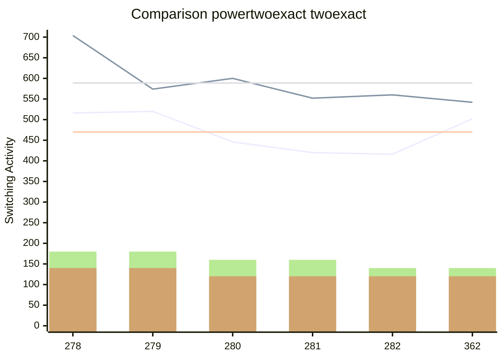

[INFO] Synthesising NPN Class=39 TruthTable:0x016A pexact:502 r=7 exact:542 r=6 time=1800.76min 

```mermaid
xychart-beta
    title "Comparison powertwoexact twoexact"
    x-axis [278, 279, 280, 281, 282, 362]
    y-axis "Switching Activity" 0-->704
    line [516, 520, 446, 420, 416, 502]
    line [704, 574, 600, 552, 560, 542]
    line [470.0, 470.0, 470.0, 470.0, 470.0, 470.0]
    line [588.6666666666666, 588.6666666666666, 588.6666666666666, 588.6666666666666, 588.6666666666666, 588.6666666666666]
    bar [180, 180, 160, 160, 140, 140]
    bar [140, 140, 120, 120, 120, 120]
```

