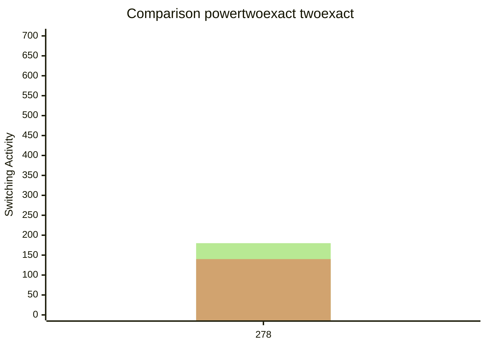

[INFO] Synthesising NPN Class=22 TruthTable:0x0116 pexact:516 r=9 exact:704 r=7 time=817.15min 

```mermaid
xychart-beta
    title "Comparison powertwoexact twoexact"
    x-axis [278]
    y-axis "Switching Activity" 0-->704
    line [516]
    line [704]
    line [516.0]
    line [704.0]
    bar [180]
    bar [140]
```

