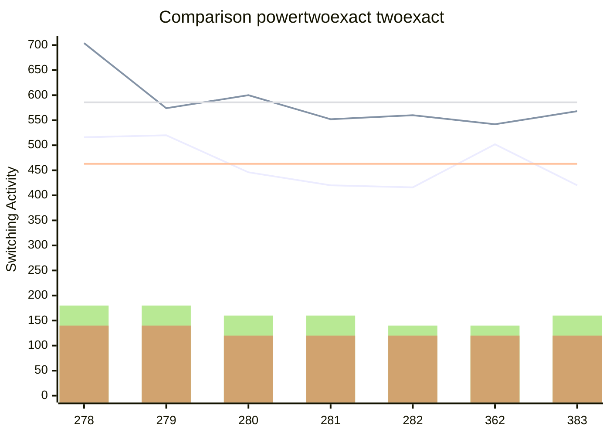

[INFO] Synthesising NPN Class=44 TruthTable:0x017F pexact:420 r=8 exact:568 r=6 time=1804.89min 

```mermaid
xychart-beta
    title "Comparison powertwoexact twoexact"
    x-axis [278, 279, 280, 281, 282, 362, 383]
    y-axis "Switching Activity" 0-->704
    line [516, 520, 446, 420, 416, 502, 420]
    line [704, 574, 600, 552, 560, 542, 568]
    line [462.85714285714283, 462.85714285714283, 462.85714285714283, 462.85714285714283, 462.85714285714283, 462.85714285714283, 462.85714285714283]
    line [585.7142857142857, 585.7142857142857, 585.7142857142857, 585.7142857142857, 585.7142857142857, 585.7142857142857, 585.7142857142857]
    bar [180, 180, 160, 160, 140, 140, 160]
    bar [140, 140, 120, 120, 120, 120, 120]
```

