[INFO] Synthesising NPN Class=22 TruthTable:0x0116 pexact:516 r=9 exact:704 r=7 time=817.15min 

[INFO] Synthesising NPN Class=23 TruthTable:0x0117 pexact:520 r=9 exact:574 r=7 time=1589.41min 

[INFO] Synthesising NPN Class=24 TruthTable:0x0118 pexact:446 r=8 exact:600 r=6 time=1617.05min 

```mermaid
xychart-beta
    title "Comparison powertwoexact twoexact"
    x-axis [278, 279, 280]
    y-axis "Switching Activity" 0-->704
    line [516, 520, 446]
    line [704, 574, 600]
    line [494.0, 494.0, 494.0]
    line [626.0, 626.0, 626.0]
    bar [180, 180, 160]
    bar [140, 140, 120]
```

